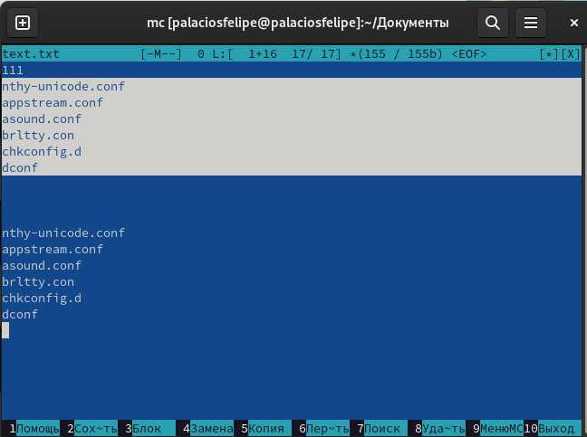

---
## Front matter
lang: ru-RU
title: Лабораторная работа 7
subtitle: Командная оболочка Midnight Commander
author:
  - Паласиос Ф. 
institute:
  - Российский университет дружбы народов, Москва, Россия
date: 24 марта 2023

## i18n babel
babel-lang: russian
babel-otherlangs: english

## Formatting pdf
toc: false
toc-title: Содержание
slide_level: 2
aspectratio: 169
section-titles: true
theme: metropolis
header-includes:
 - \metroset{progressbar=frametitle,sectionpage=progressbar,numbering=fraction}
 - '\makeatletter'
 - '\beamer@ignorenonframefalse'
 - '\makeatother'
---

# Информация

## Докладчик

:::::::::::::: {.columns align=center}
::: {.column width="70%"}

  * Паласиос Фелипе
  * студент группы НКАбд - 04 - 22
  * Российский университет дружбы народов

:::
::: {.column width="30%"}

:::
::::::::::::::

# Вводная часть

## Цель

Освоение основных возможностей командной оболочки Midnight Commander. Приоб-
ретение навыков практической работы по просмотру каталогов и файлов; манипуляций
с ними.

## Задачи

1. Изучите информацию о mc, вызвав в командной строке man mc.
2. Запустите из командной строки mc, изучите его структуру и меню.
3. Выполните несколько операций в mc, используя управляющие клавиши (операции
с панелями; выделение/отмена выделения файлов, копирование/перемещение фай-
лов, получение информации о размере и правах доступа на файлы и/или каталоги
и т.п.)
4. Выполните основные команды меню левой (или правой) панели. Оцените степень
подробности вывода информации о файлах.

## Задачи

5. Используя возможности подменю Файл , выполните:
– просмотр содержимого текстового файла;
– редактирование содержимого текстового файла (без сохранения результатов
редактирования);
– создание каталога;
– копирование в файлов в созданный каталог.
6. С помощью соответствующих средств подменю Команда осуществите:
– поиск в файловой системе файла с заданными условиями (например, файла
с расширением .c или .cpp, содержащего строку main);
– выбор и повторение одной из предыдущих команд;
– переход в домашний каталог;
– анализ файла меню и файла расширений.

## Задачи

7. Вызовите подменю Настройки . Освойте операции, определяющие структуру экрана mc
(Full screen, Double Width, Show Hidden Files и т.д.)
8. Создайте текстовой файл text.txt.
9. Откройте этот файл с помощью встроенного в mc редактора.
10. Вставьте в открытый файл небольшой фрагмент текста, скопированный из любого
другого файла или Интернета.

## Задачи

11. Проделайте с текстом следующие манипуляции, используя горячие клавиши:
4.1. Удалите строку текста.
4.2. Выделите фрагмент текста и скопируйте его на новую строку.
4.3. Выделите фрагмент текста и перенесите его на новую строку.
4.4. Сохраните файл.
4.5. Отмените последнее действие.
4.6. Перейдите в конец файла (нажав комбинацию клавиш) и напишите некоторый
текст.

## Задачи

4.7. Перейдите в начало файла (нажав комбинацию клавиш) и напишите некоторый
текст.
4.8. Сохраните и закройте файл.

## Задачи

12. Откройте файл с исходным текстом на некотором языке программирования (напри-
мер C или Java)
13. Используя меню редактора, включите подсветку синтаксиса, если она не включена,
или выключите, если она включена.

# Выполнение лабораторной работы

## Результаты

1. Изучите информацию о mc, вызвав в командной строке man mc 

## Результаты

2. Запустите из командной строки mc, изучите его структуру и меню 

## Результаты

3. Выполните несколько операций в mc, используя управляющие клавиши (операциис панелями; выделение/отмена выделения файлов, копирование/перемещение файлов, получение информации о размере и правах доступа на файлы и/или каталоги и т.п.)

## Результаты

4. Выполните основные команды меню левой (или правой) панели. Оцените стлиепень
подробности вывода информации о файлах 

## Результаты

5. Используя возможности подменю Файл , выполнили:
– просмотр содержимого текстового файла 

## Результаты

– редактирование содержимого текстового файла (без сохранения результатов
редактирования) 

## Результаты

– создание каталога 

## Результаты

– копирование в файлов в созданный каталог 

## Результаты

6. С помощью соответствующих средств подменю Команда осуществите:
– поиск в файловой системе файла с заданными условиями (например, файла
с расширением .c или .cpp, содержащего строку main) 

## Результаты

– выбор и повторение одной из предыдущих команд 

## Результаты

– переход в домашний каталог 

## Результаты

– анализ файла меню и файла расширений 

## Результаты

7. Вызовите подменю Настройки . Освойте операции, определяющие структуру экрана mc(Full screen, Double Width, Show Hidden Files и т.д.)

## Результаты

## Результаты

8. Создайте текстовой файл text.txt 

## Результаты

9. Откройте этот файл с помощью встроенного в mc редактора 

## Результаты

10. Вставьте в открытый файл небольшой фрагмент текста, скопированный из любогодругого файла или Интернета 

## Результаты

11. Проделайте с текстом следующие манипуляции, используя горячие клавиши:Удалите строку текста, Выделите фрагмент текста и скопируйте его на новую строку,Выделите фрагмент текста и перенесите его на новую строку, Сохраните файл, Отмените последнее действие, Перейдите в конец файла (нажав комбинацию клавиш) и напишите некоторый текст, Перейдите в начало файла (нажав комбинацию клавиш) и напишите некоторый текст. Сохраните и закройте файл.

## Результаты

## Результаты

## Результаты

12. Откройте файл с исходным текстом на некотором языке программирования (например C или Java)

13. Используя меню редактора, включите подсветку синтаксиса, если она не включена,или выключите, если она включена

## Результаты

Освоены основные возможности командной оболочки Midnight Commander. Приобретены навыки практической работы по просмотру каталогов и файлов; манипуляций с ними.
