---
## Front matter
lang: ru-RU
title: Лабораторная работа 8
subtitle: Текстовой редактор vi
author:
  - - Паласиос Ф. 
institute:
  - Российский университет дружбы народов, Москва, Россия
  
date: 01 апреля 2023

## i18n babel
babel-lang: russian
babel-otherlangs: english

## Formatting pdf
toc: false
toc-title: Содержание
slide_level: 2
aspectratio: 169
section-titles: true
theme: metropolis
header-includes:
 - \metroset{progressbar=frametitle,sectionpage=progressbar,numbering=fraction}
 - '\makeatletter'
 - '\beamer@ignorenonframefalse'
 - '\makeatother'
---

# Информация

## Докладчик

:::::::::::::: {.columns align=center}
::: {.column width="70%"}

  * Паласиос Фелипе
  * студент группы НКАбд - 04 - 22
  * Российский университет дружбы народов

:::
::: {.column width="30%"}

:::
::::::::::::::

# Вводная часть

## Цели 

Познакомиться с операционной системой Linux. Получить практические навыки работы с редактором vi, установленным по умолчанию практически во всех дистрибутивах.

## Задачи

1. Изучите информацию о mc, вызвав в командной строке man mc.
2. Запустите из командной строки mc, изучите его структуру и меню.
3. Выполните несколько операций в mc, используя управляющие клавиши (операции
с панелями; выделение/отмена выделения файлов, копирование/перемещение фай-
лов, получение информации о размере и правах доступа на файлы и/или каталоги
и т.п.)

## Задачи

4. Выполните основные команды меню левой (или правой) панели. Оцените степень
подробности вывода информации о файлах.
5. Нажмите клавишу Esc для перехода в командный режим после завершения ввода
текста.
6. Нажмите : для перехода в режим последней строки и внизу вашего экрана появится
приглашение в виде двоеточия.

## Задачи

7. Нажмите w (записать) и q (выйти), а затем нажмите клавишу Enter для сохранения
вашего текста и завершения работы.
8. Сделайте файл исполняемым

# Задание 2

1. Вызовите vi на редактирование файла
2. Установите курсор в конец слова HELL второй строки.
3. Перейдите в режим вставки и замените на HELLO. Нажмите Esc для возврата в команд-
ный режим.
4. Установите курсор на четвертую строку и сотрите слово LOCAL.

## Задачи

5. Перейдите в режим вставки и наберите следующий текст: local, нажмите Esc для возврата в командный режим.
6. Установите курсор на последней строке файла. Вставьте после неё строку, содержащую
следующий текст: echo $HELLO.
7. Нажмите Esc для перехода в командный режим.
8. Удалите последнюю строку.

## Задачи

9. Введите команду отмены изменений u для отмены последней команды.
10. Введите символ : для перехода в режим последней строки. Запишите произведённые изменения и выйдите из vi.

# Выполнение лабораторной работы 1

# Результаты

1. Создайте каталог с именем ~/work/os/lab06 

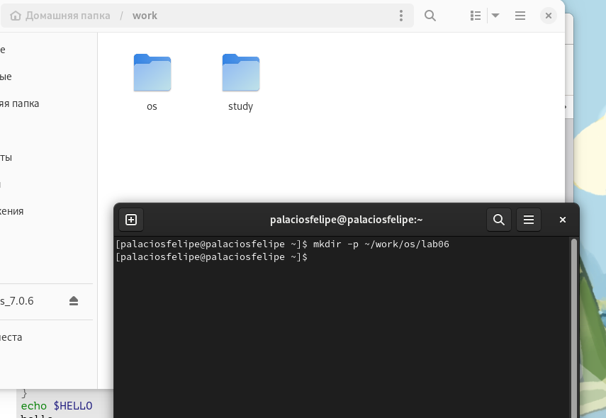

## Результаты

2. Перейдите во вновь созданный каталог 

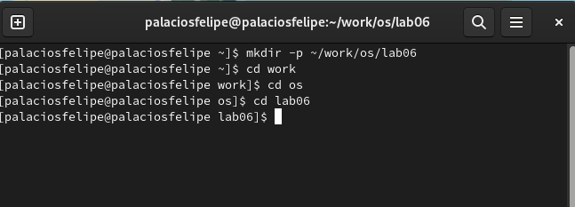

## Результаты

3. Вызовите vi и создайте файл hello.sh 

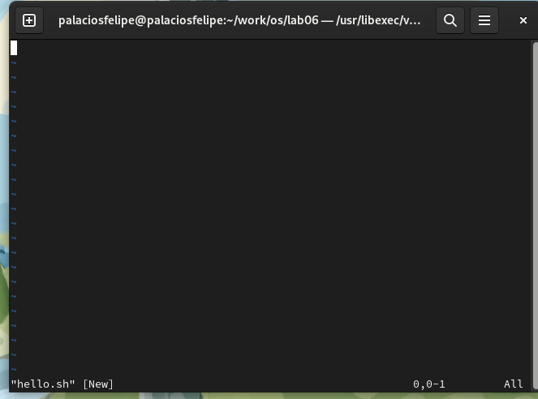

## Результаты

4. Нажмите клавишу i и вводите следующий текст 

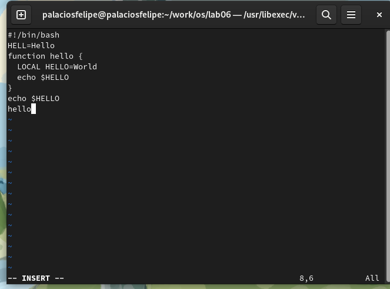

## Результаты

5. Нажмите клавишу Esc для перехода в командный режим после завершения ввода
 текста 

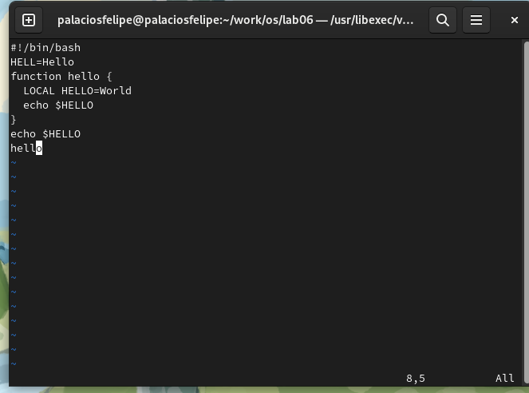

## Результаты

6. Нажмите : для перехода в режим последней строки и внизу вашего 
  экрана появится приглашение в виде двоеточия 

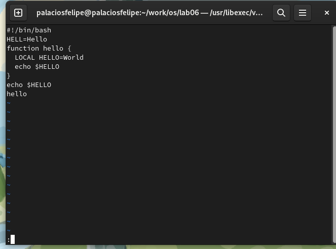

## Результаты

7. Нажмите w (записать) и q (выйти), а затем нажмите клавишу Enter для сохранения вашего текста и завершения работы 

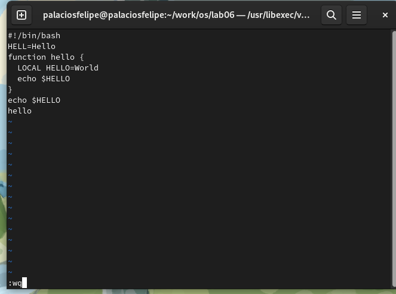

## Результаты

8. Сделайте файл исполняемым 

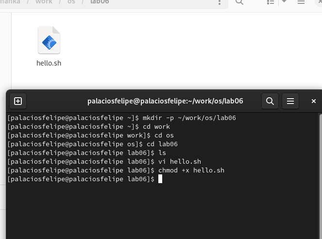

## Результаты

# Выполнение лабораторной работы 2

1. Вызовите vi на редактирование файла 

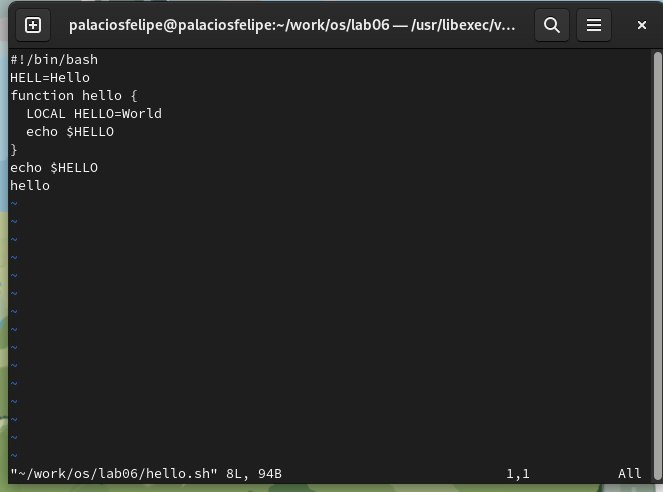

## Результаты

2. Установите курсор в конец слова HELL второй строки 

## Результаты

3. Перейдите в режим вставки и замените на HELLO. Нажмите Esc для возврата в команд-ный режим 

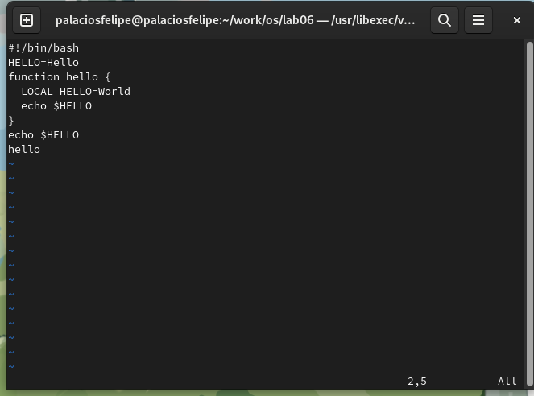

## Результаты

4. Установите курсор на четвертую строку и сотрите слово LOCAL 

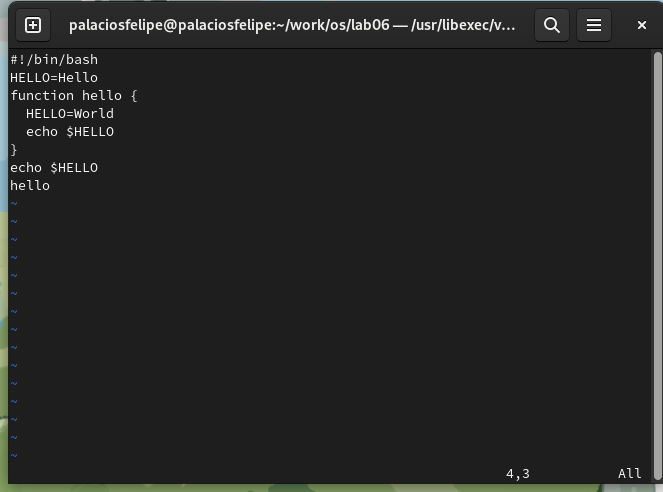

## Результаты

5. Перейдите в режим вставки и наберите следующий текст: local, нажмите Esc для возврата в командный режим 

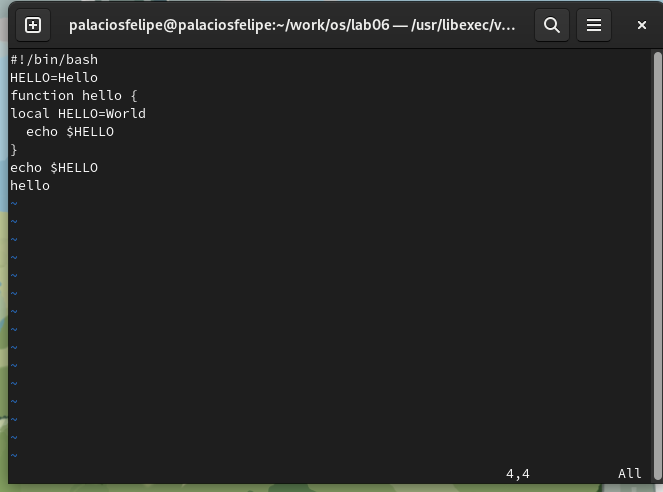

## Результаты

6. Установите курсор на последней строке файла. Вставьте после неё строку, содержащую следующий текст: echo $HELLO 

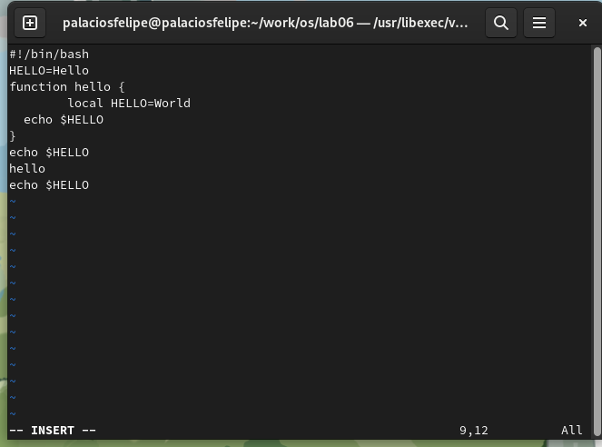

## Результаты

7. Нажмите Esc для перехода в командный режим 

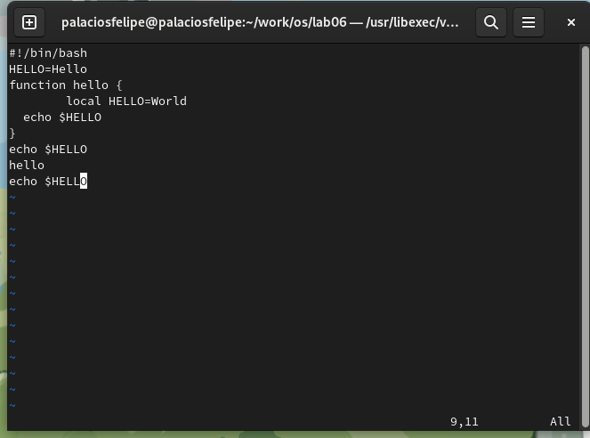

## Результаты

8. Удалите последнюю строку 

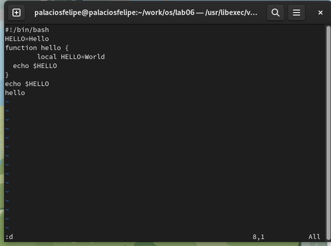

## Результаты

9. Введите команду отмены изменений u для отмены последней команды 

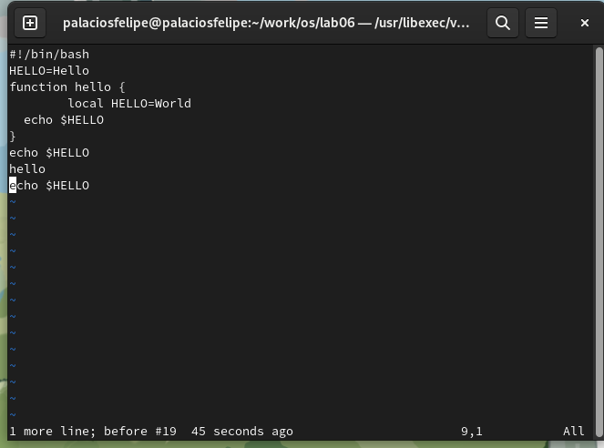

## Результаты

10. Введите символ : для перехода в режим последней строки. Запишите произведённые изменения и выйдите из vi 

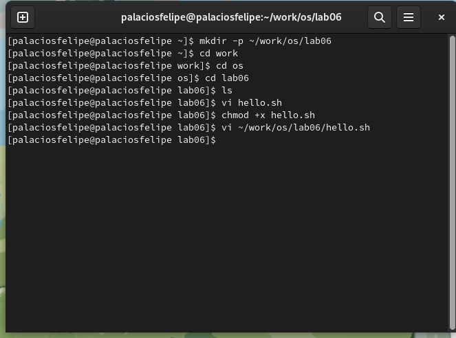

## Результаты

Освоены основные возможности командной оболочки Midnight Commander. Приобретены навыки практической работы по просмотру каталогов и файлов; манипуляций с ними.
