---
## Front matter
title: "Лабораторная работа 8"
subtitle: "Текстовой редактор vi"
author: "Паласиос Фелипе"

## Generic otions
lang: ru-RU
toc-title: "Содержание"

## Bibliography
bibliography: bib/cite.bib
csl: pandoc/csl/gost-r-7-0-5-2008-numeric.csl

## Pdf output format
toc: true # Table of contents
toc-depth: 2
lof: true # List of figures
lot: true # List of tables
fontsize: 12pt
linestretch: 1.5
papersize: a4
documentclass: scrreprt
## I18n polyglossia
polyglossia-lang:
  name: russian
  options:
	- spelling=modern
	- babelshorthands=true
polyglossia-otherlangs:
  name: english
## I18n babel
babel-lang: russian
babel-otherlangs: english
## Fonts
mainfont: PT Serif
romanfont: PT Serif
sansfont: PT Sans
monofont: PT Mono
mainfontoptions: Ligatures=TeX
romanfontoptions: Ligatures=TeX
sansfontoptions: Ligatures=TeX,Scale=MatchLowercase
monofontoptions: Scale=MatchLowercase,Scale=0.9
## Biblatex
biblatex: true
biblio-style: "gost-numeric"
biblatexoptions:
  - parentracker=true
  - backend=biber
  - hyperref=auto
  - language=auto
  - autolang=other*
  - citestyle=gost-numeric
## Pandoc-crossref LaTeX customization
figureTitle: "Рис."
tableTitle: "Таблица"
listingTitle: "Листинг"
lofTitle: "Список иллюстраций"
lotTitle: "Список таблиц"
lolTitle: "Листинги"
## Misc options
indent: true
header-includes:
  - \usepackage{indentfirst}
  - \usepackage{float} # keep figures where there are in the text
  - \floatplacement{figure}{H} # keep figures where there are in the text
---

# Цель работы

Познакомиться с операционной системой Linux. Получить практические навыки работы с редактором vi, установленным по умолчанию практически во всех дистрибутивах.

# Задание 1

1. Создайте каталог с именем ~/work/os/lab06.
2. Перейдите во вновь созданный каталог.
3. Вызовите vi и создайте файл hello.sh
4. Нажмите клавишу i и вводите следующий текст.
5. Нажмите клавишу Esc для перехода в командный режим после завершения ввода
текста.
6. Нажмите : для перехода в режим последней строки и внизу вашего экрана появится
приглашение в виде двоеточия.
7. Нажмите w (записать) и q (выйти), а затем нажмите клавишу Enter для сохранения
вашего текста и завершения работы.
8. Сделайте файл исполняемым

# Задание 2

1. Вызовите vi на редактирование файла
2. Установите курсор в конец слова HELL второй строки.
3. Перейдите в режим вставки и замените на HELLO. Нажмите Esc для возврата в команд-
ный режим.
4. Установите курсор на четвертую строку и сотрите слово LOCAL.
5. Перейдите в режим вставки и наберите следующий текст: local, нажмите Esc для возврата в командный режим.
6. Установите курсор на последней строке файла. Вставьте после неё строку, содержащую
следующий текст: echo $HELLO.
7. Нажмите Esc для перехода в командный режим.
8. Удалите последнюю строку.
9. Введите команду отмены изменений u для отмены последней команды.
10. Введите символ : для перехода в режим последней строки. Запишите произведённые изменения и выйдите из vi.

# Выполнение лабораторной работы 1

1. Создайте каталог с именем ~/work/os/lab06 (рис. @fig:001)

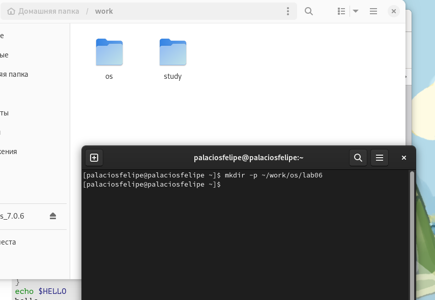{#fig:001 width=70%}

2. Перейдите во вновь созданный каталог (рис. @fig:002)

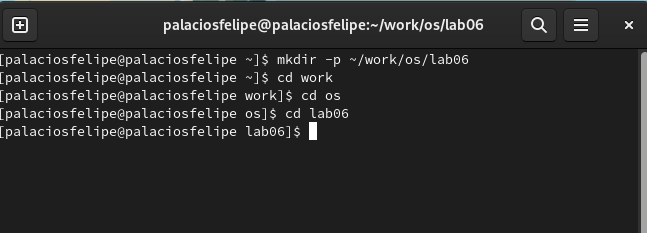{#fig:002 width=70%}

3. Вызовите vi и создайте файл hello.sh (рис. @fig:003)

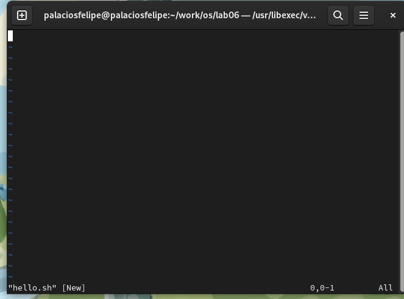{#fig:003 width=70%}

4. Нажмите клавишу i и вводите следующий текст (рис. @fig:004)

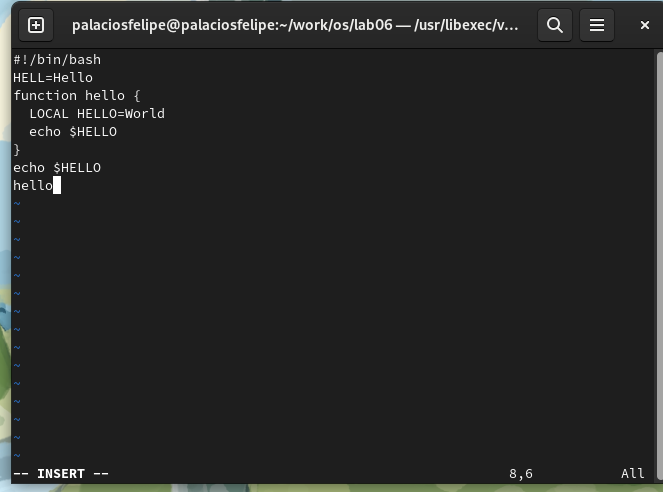{#fig:004 width=70%}

5. Нажмите клавишу Esc для перехода в командный режим после завершения ввода
 текста (рис. @fig:005)

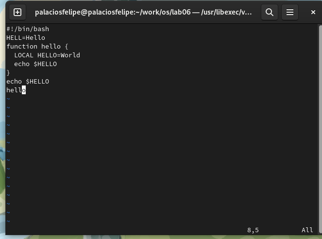{#fig:005 width=70%}

6. Нажмите : для перехода в режим последней строки и внизу вашего 
  экрана появится приглашение в виде двоеточия (рис. @fig:006)

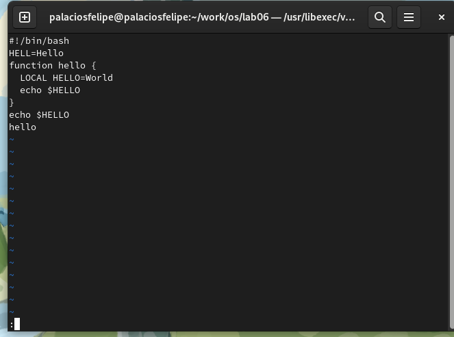{#fig:006 width=70%}

7. Нажмите w (записать) и q (выйти), а затем нажмите клавишу Enter для сохранения вашего текста и завершения работы (рис. @fig:007)

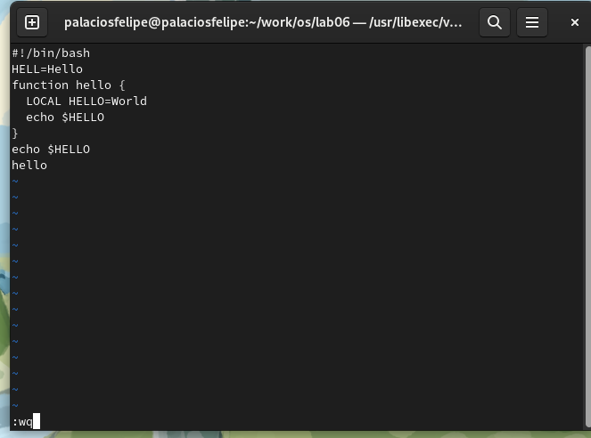{#fig:007 width=70%}

8. Сделайте файл исполняемым (рис. @fig:008) (рис. @fig:008)

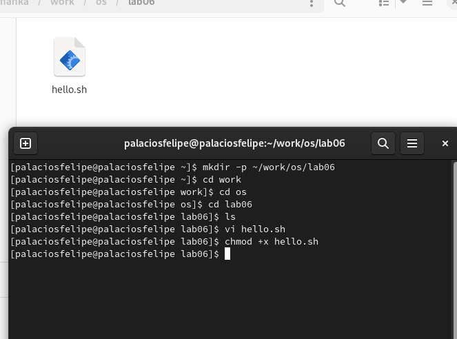{#fig:008 width=70%} 

# Выполнение лабораторной работы 2

1. Вызовите vi на редактирование файла (рис. @fig:009)

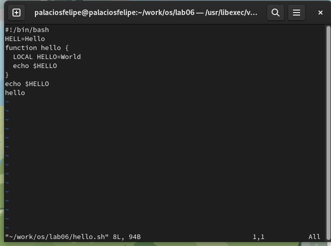{#fig:009 width=70%}

2. Установите курсор в конец слова HELL второй строки (рис. @fig:010)

{#fig:010 width=70%}

3. Перейдите в режим вставки и замените на HELLO. Нажмите Esc для возврата в команд-ный режим (рис. @fig:011)

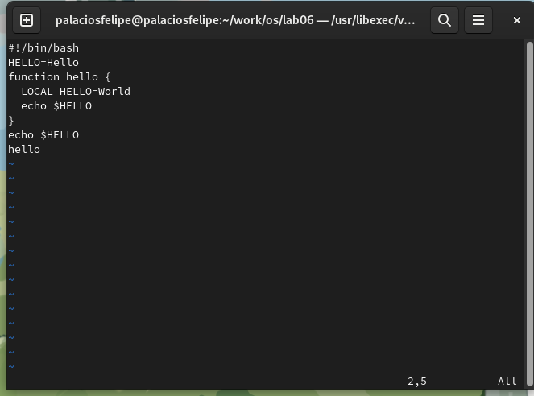{#fig:011 width=70%}

4. Установите курсор на четвертую строку и сотрите слово LOCAL (рис. @fig:012)

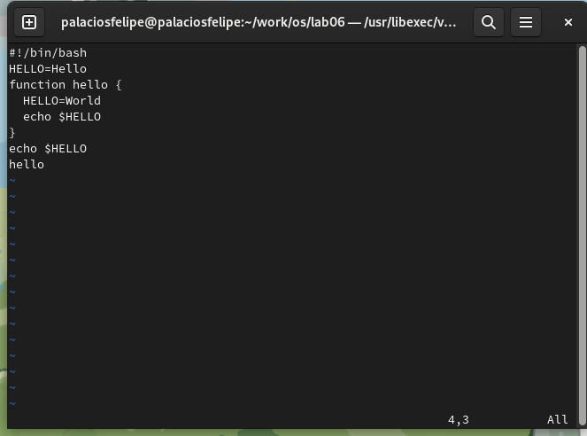{#fig:012 width=70%}

5. Перейдите в режим вставки и наберите следующий текст: local, нажмите Esc для возврата в командный режим (рис. @fig:013)

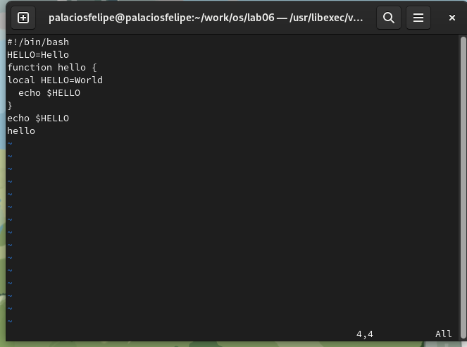{#fig:013 width=70%}

6. Установите курсор на последней строке файла. Вставьте после неё строку, содержащую следующий текст: echo $HELLO (рис. @fig:014)

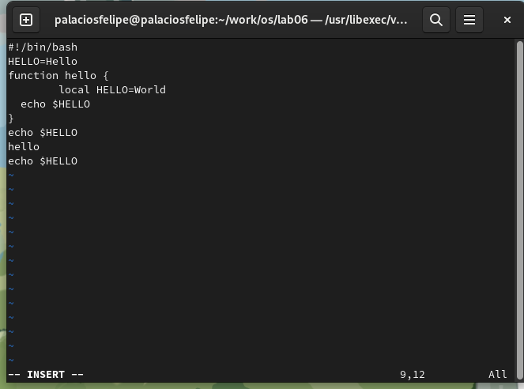{#fig:014 width=70%}

7. Нажмите Esc для перехода в командный режим (рис. @fig:015)

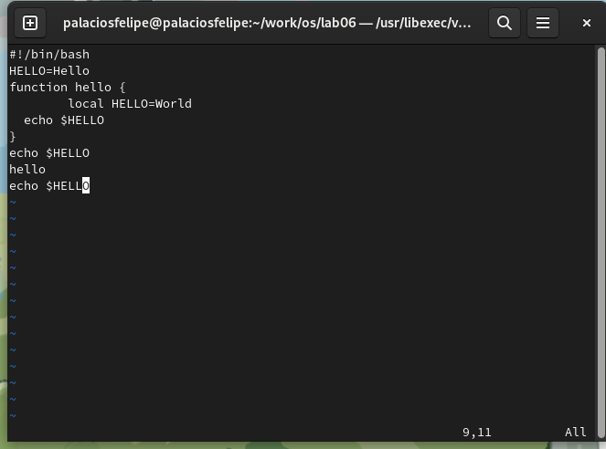{#fig:015 width=70%}

8. Удалите последнюю строку (рис. @fig:016)

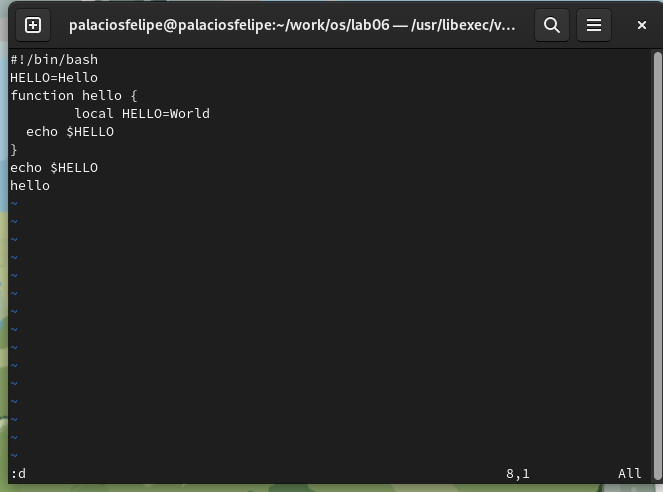{#fig:016 width=70%}

9. Введите команду отмены изменений u для отмены последней команды (рис. @fig:017)

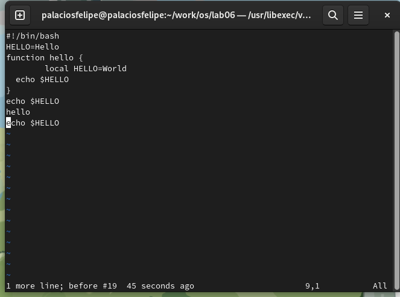{#fig:017 width=70%}

10. Введите символ : для перехода в режим последней строки. Запишите произведённые изменения и выйдите из vi (рис. @fig:018)

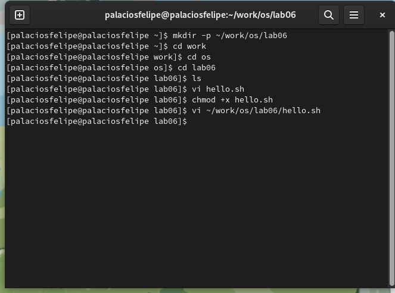{#fig:018 width=70%}

# Выводы

Познакомились с операционной системой Linux. Получили практические навыки работы с редактором vi, установленным по умолчанию практически во всех дистрибутивах.

