---
## Front matter
lang: ru-RU
title: Лабораторная работа 9
subtitle: Текстовой редактор emacs
author:
  - Паласиос Ф. 
institute:
  - Российский университет дружбы народов, Москва, Россия
date: 07 апреля 2023

## i18n babel
babel-lang: russian
babel-otherlangs: english

## Formatting pdf
toc: false
toc-title: Содержание
slide_level: 2
aspectratio: 169
section-titles: true
theme: metropolis
header-includes:
 - \metroset{progressbar=frametitle,sectionpage=progressbar,numbering=fraction}
 - '\makeatletter'
 - '\beamer@ignorenonframefalse'
 - '\makeatother'
---

# Информация

## Докладчик

:::::::::::::: {.columns align=center}
::: {.column width="70%"}

  * Паласиос Фелипе
  * студент группы НКАбд - 04 - 22
  * Российский университет дружбы народов

:::
::: {.column width="30%"}

:::
::::::::::::::

# Вводная часть

## Цель

Познакомиться с операционной системой Linux. Получить практические навыки рабо-
ты с редактором Emacs.

## Задачи

1. Открыть emacs.
2. Создать файл lab07.sh с помощью комбинации Ctrl-x Ctrl-f (C-x C-f).
3. Наберите текст

## Задачи

4. Сохранить файл с помощью комбинации Ctrl-x Ctrl-s (C-x C-s).
5. Проделать с текстом стандартные процедуры редактирования, каждое действие должно осуществляться комбинацией клавиш.
5.1. Вырезать одной командой целую строку (С-k).

## Задачи

5.2. Вставить эту строку в конец файла (C-y).
5.3. Выделить область текста (C-space).
5.4. Скопировать область в буфер обмена (M-w).
5.5. Вставить область в конец файла.

## Задачи

5.6. Вновь выделить эту область и на этот раз вырезать её (C-w).
5.7. Отмените последнее действие (C-/).
6. Научитесь использовать команды по перемещению курсора.
6.1. Переместите курсор в начало строки (C-a).

## Задачи

6.2. Переместите курсор в конец строки (C-e)
6.3. Переместите курсор в начало буфера (M-<).
6.4. Переместите курсор в конец буфера (M->).
7. Управление буферами.
7.1. Вывести список активных буферов на экран (C-x C-b).

## Задачи

7.2. Переместитесь во вновь открытое окно (C-x) o со списком открытых буферов
и переключитесь на другой буфер.
7.3. Закройте это окно (C-x 0).
7.4. Теперь вновь переключайтесь между буферами, но уже без вывода их списка на
экран (C-x b).

## Задачи

8. Управление окнами.
8.1. Поделите фрейм на 4 части: разделите фрейм на два окна по вертикали (C-x 3), а затем каждое из этих окон на две части по горизонтали (C-x 2) 
8.2. В каждом из четырёх созданных окон откройте новый буфер (файл) и введите
несколько строк текста.

## Задачи

9. Режим поиска
9.1. Переключитесь в режим поиска (C-s) и найдите несколько слов, присутствующих
в тексте.
9.2. Переключайтесь между результатами поиска, нажимая C-s.
9.3. Выйдите из режима поиска, нажав C-g.

## Задачи

9.4. Перейдите в режим поиска и замены (M-%), введите текст, который следует найти и заменить, нажмите Enter , затем введите текст для замены. После того как будут подсвечены результаты поиска, нажмите ! для подтверждения замены.
9.5. Испробуйте другой режим поиска, нажав M-s o. Объясните, чем он отличается от обычного режима?

# Выполнение лабораторной работы
## Результаты

1. Открыть emacs

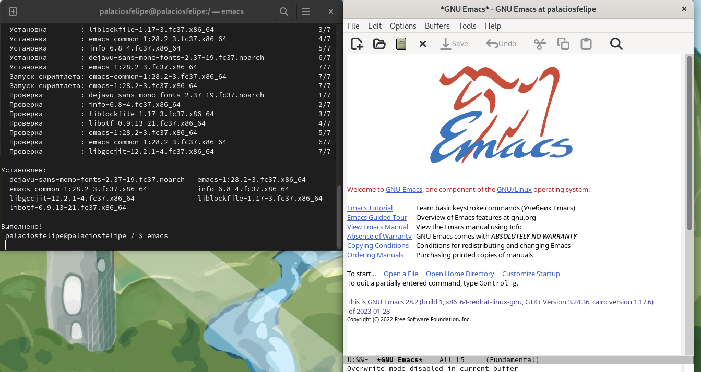

## Результаты

2. Создать файл lab07.sh с помощью комбинации Ctrl-x Ctrl-f (C-x C-f) 

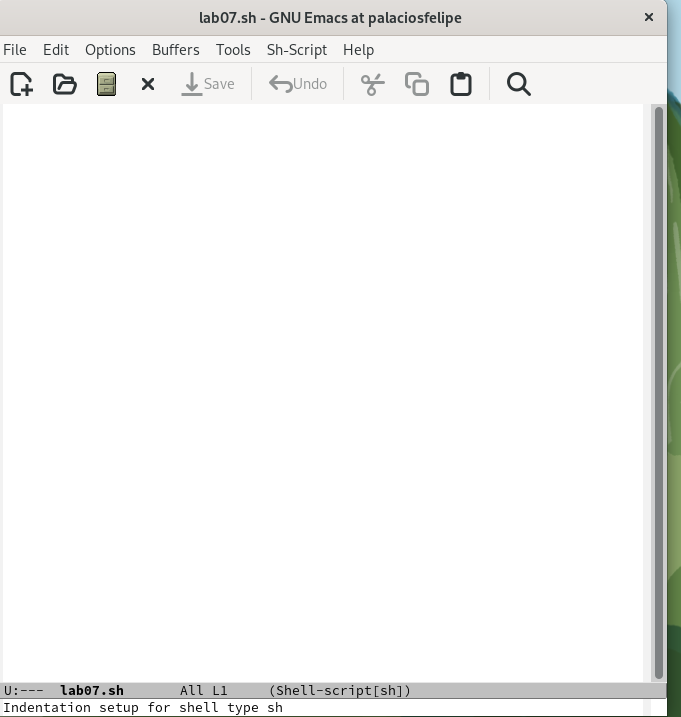

## Результаты

3. Наберите текст 

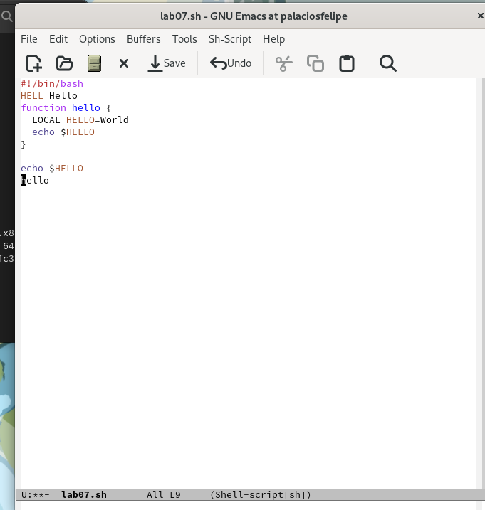

## Результаты

4. Сохранить файл с помощью комбинации Ctrl-x Ctrl-s (C-x C-s) 

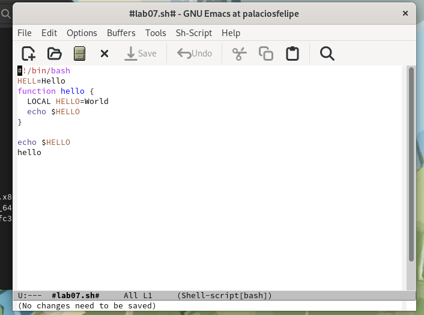

## Результаты

5. Проделать с текстом стандартные процедуры редактирования, каждое действие должно осуществляться комбинацией клавиш 
5.1. Вырезать одной командой целую строку (С-k) 

## Результаты

5.2. Вставить эту строку в конец файла (C-y) 

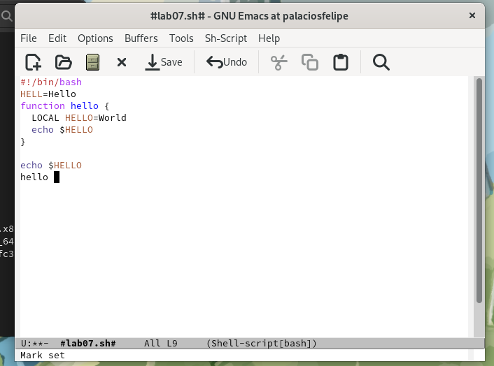

## Результаты

5.3. Выделить область текста (C-space) 

## Результаты

5.4. Скопировать область в буфер обмена (M-w) 

5.5. Вставить область в конец файла 

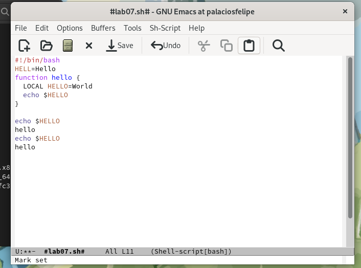

## Результаты

5.6. Вновь выделить эту область и на этот раз вырезать её (C-w) 

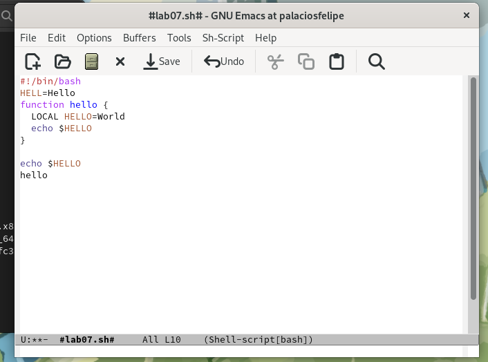

## Результаты

5.7. Отмените последнее действие (C-/) 

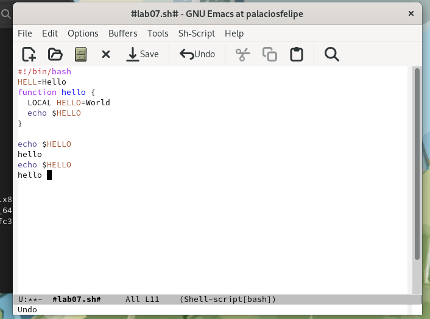

## Результаты

6. Научитесь использовать команды по перемещению курсора 

6.1. Переместите курсор в начало строки (C-a) 

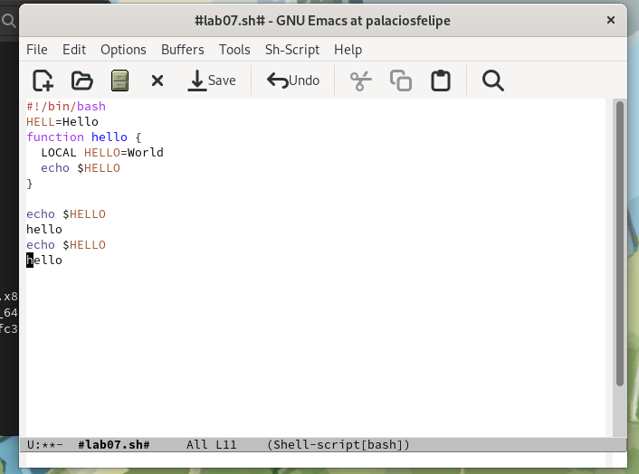

## Результаты

6.2. Переместите курсор в конец строки (C-e) 

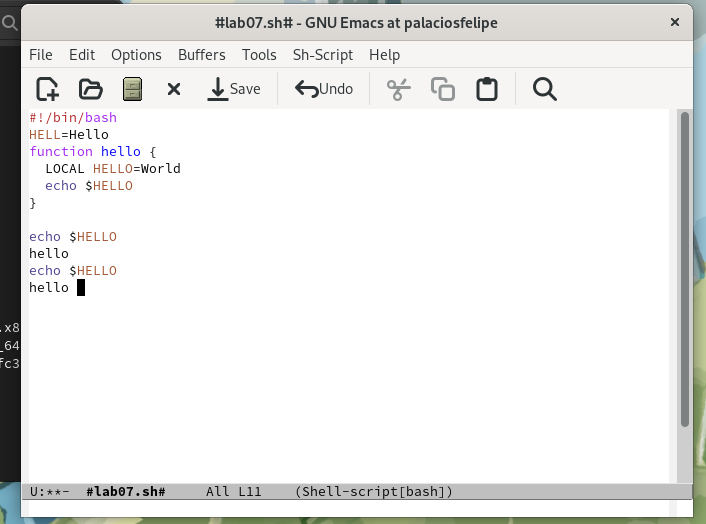

6.3. Переместите курсор в начало буфера (M-<) 
6.4. Переместите курсор в конец буфера (M->) 

## Результаты

7. Управление буферами 

7.1. Вывести список активных буферов на экран (C-x C-b) 

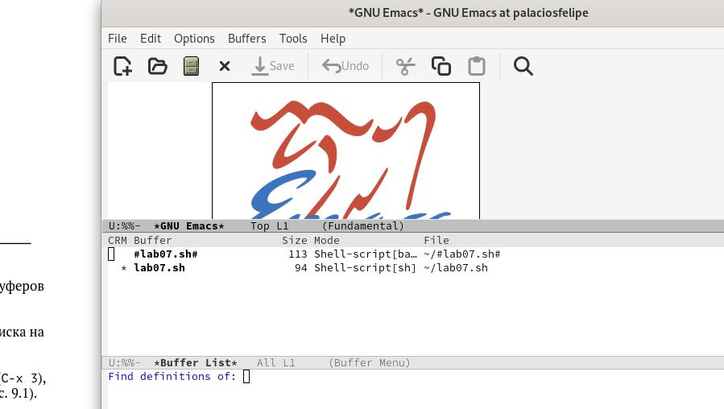

## Результаты

7.2. Переместитесь во вновь открытое окно (C-x) o со списком открытых буферов и переключитесь на другой буфер 

## Результаты

7.3. Закройте это окно (C-x 0) 

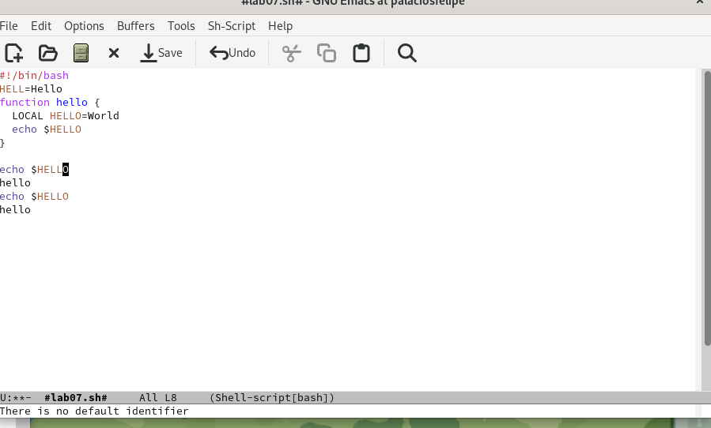

## Результаты

7.4. Теперь вновь переключайтесь между буферами, но уже без вывода их списка на экран (C-x b) 

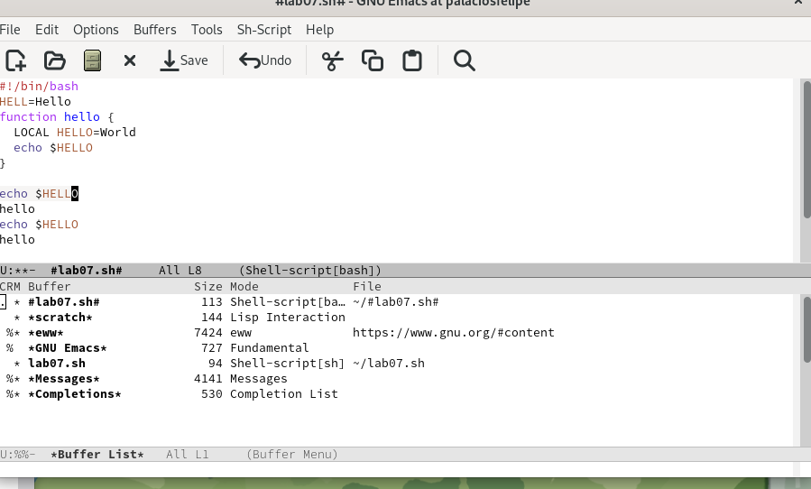

## Результаты

8. Управление окнами 

8.1. Поделите фрейм на 4 части: разделите фрейм на два окна по вертикали (C-x 3), а затем каждое из этих окон на две части по горизонтали (C-x 2) 

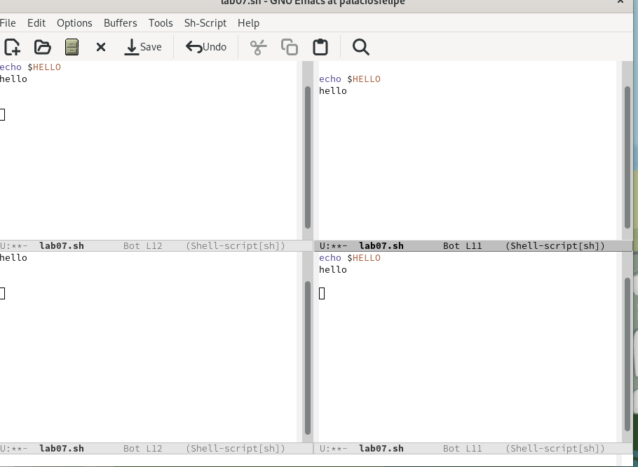

## Результаты

8.2. В каждом из четырёх созданных окон откройте новый буфер (файл) и введите несколько строк текста 

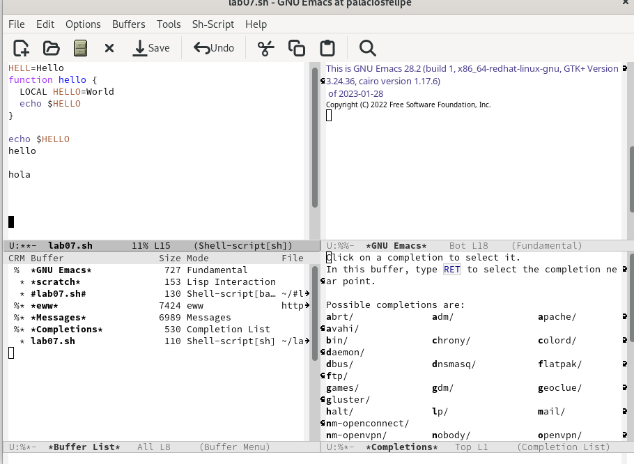

## Результаты

9. Режим поиска

9.1. Переключитесь в режим поиска (C-s) и найдите несколько слов, присутствующих в тексте 

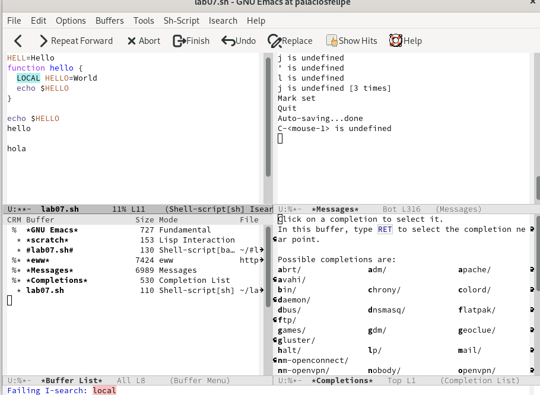

## Результаты

9.2. Переключайтесь между результатами поиска, нажимая C-s 

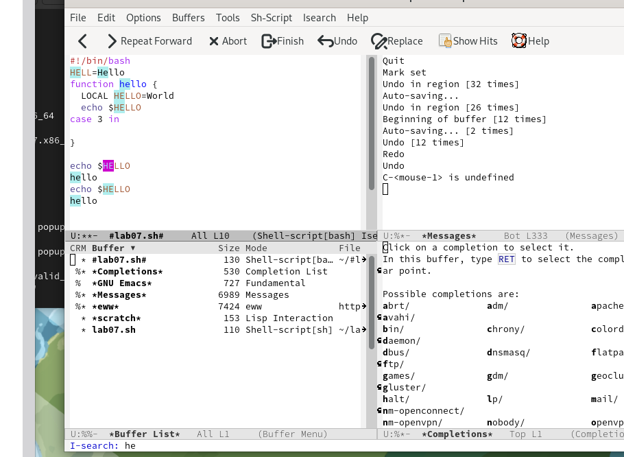

## Результаты

9.3. Выйдите из режима поиска, нажав C-g 

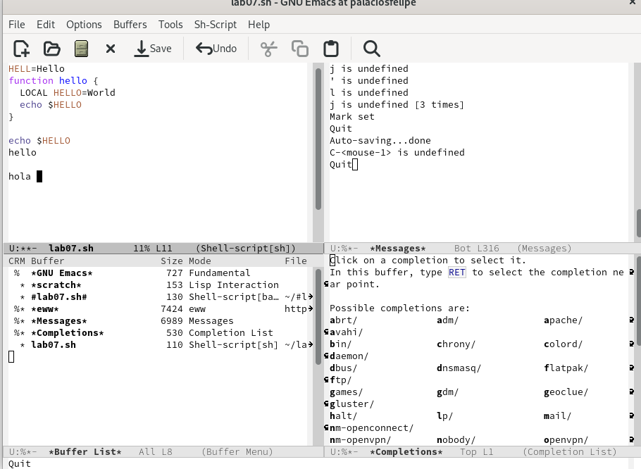

9.4. Перейдите в режим поиска и замены (M-%), введите текст, который следует найти и заменить, нажмите Enter , затем введите текст для замены. После того как будут подсвечены результаты поиска, нажмите ! для подтверждения замены 

## Результаты

9.5. Испробуйте другой режим поиска, нажав M-s o. Объясните, чем он отличается от обычного режима? 
Не выделяет слово в тексте, а вытаскивает в окно

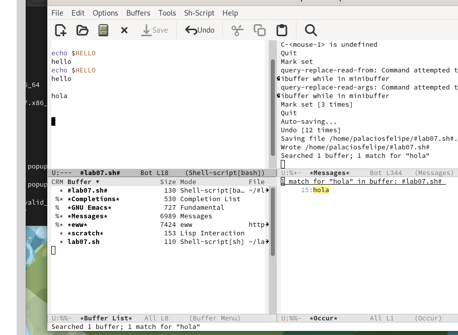

## Результаты

Познакомился с операционной системой Linux. Получил практические навыки работы с редактором Emacs.

