---
## Front matter
title: "Лабораторная работа 9"
subtitle: "Текстовой редактор emacs"
author: "Паласиос Фелипе"

## Generic otions
lang: ru-RU
toc-title: "Содержание"

## Bibliography
bibliography: bib/cite.bib
csl: pandoc/csl/gost-r-7-0-5-2008-numeric.csl

## Pdf output format
toc: true # Table of contents
toc-depth: 2
lof: true # List of figures
lot: true # List of tables
fontsize: 12pt
linestretch: 1.5
papersize: a4
documentclass: scrreprt
## I18n polyglossia
polyglossia-lang:
  name: russian
  options:
	- spelling=modern
	- babelshorthands=true
polyglossia-otherlangs:
  name: english
## I18n babel
babel-lang: russian
babel-otherlangs: english
## Fonts
mainfont: PT Serif
romanfont: PT Serif
sansfont: PT Sans
monofont: PT Mono
mainfontoptions: Ligatures=TeX
romanfontoptions: Ligatures=TeX
sansfontoptions: Ligatures=TeX,Scale=MatchLowercase
monofontoptions: Scale=MatchLowercase,Scale=0.9
## Biblatex
biblatex: true
biblio-style: "gost-numeric"
biblatexoptions:
  - parentracker=true
  - backend=biber
  - hyperref=auto
  - language=auto
  - autolang=other*
  - citestyle=gost-numeric
## Pandoc-crossref LaTeX customization
figureTitle: "Рис."
tableTitle: "Таблица"
listingTitle: "Листинг"
lofTitle: "Список иллюстраций"
lotTitle: "Список таблиц"
lolTitle: "Листинги"
## Misc options
indent: true
header-includes:
  - \usepackage{indentfirst}
  - \usepackage{float} # keep figures where there are in the text
  - \floatplacement{figure}{H} # keep figures where there are in the text
---

# Цель работы

Познакомиться с операционной системой Linux. Получить практические навыки рабо-
ты с редактором Emacs

# Задание

1. Открыть emacs.
2. Создать файл lab07.sh с помощью комбинации Ctrl-x Ctrl-f (C-x C-f).
3. Наберите текст
4. Сохранить файл с помощью комбинации Ctrl-x Ctrl-s (C-x C-s).
5. Проделать с текстом стандартные процедуры редактирования, каждое действие должно осуществляться комбинацией клавиш.
5.1. Вырезать одной командой целую строку (С-k).
5.2. Вставить эту строку в конец файла (C-y).
5.3. Выделить область текста (C-space).
5.4. Скопировать область в буфер обмена (M-w).
5.5. Вставить область в конец файла.
5.6. Вновь выделить эту область и на этот раз вырезать её (C-w).
5.7. Отмените последнее действие (C-/).
6. Научитесь использовать команды по перемещению курсора.
6.1. Переместите курсор в начало строки (C-a).
6.2. Переместите курсор в конец строки (C-e).
6.3. Переместите курсор в начало буфера (M-<).
6.4. Переместите курсор в конец буфера (M->).
7. Управление буферами.
7.1. Вывести список активных буферов на экран (C-x C-b).
7.2. Переместитесь во вновь открытое окно (C-x) o со списком открытых буферов
и переключитесь на другой буфер.
7.3. Закройте это окно (C-x 0).
7.4. Теперь вновь переключайтесь между буферами, но уже без вывода их списка на
экран (C-x b).
8. Управление окнами.
8.1. Поделите фрейм на 4 части: разделите фрейм на два окна по вертикали (C-x 3), а затем каждое из этих окон на две части по горизонтали (C-x 2) (см. рис. 9.1)
8.2. В каждом из четырёх созданных окон откройте новый буфер (файл) и введите
несколько строк текста.
9. Режим поиска
9.1. Переключитесь в режим поиска (C-s) и найдите несколько слов, присутствующих
в тексте.
9.2. Переключайтесь между результатами поиска, нажимая C-s.
9.3. Выйдите из режима поиска, нажав C-g.
9.4. Перейдите в режим поиска и замены (M-%), введите текст, который следует найти
и заменить, нажмите Enter , затем введите текст для замены. После того как будут
подсвечены результаты поиска, нажмите ! для подтверждения замены.
9.5. Испробуйте другой режим поиска, нажав M-s o. Объясните, чем он отличается от обычного режима?

# Выполнение лабораторной работы

1. Открыть emacs (рис. @fig:001)

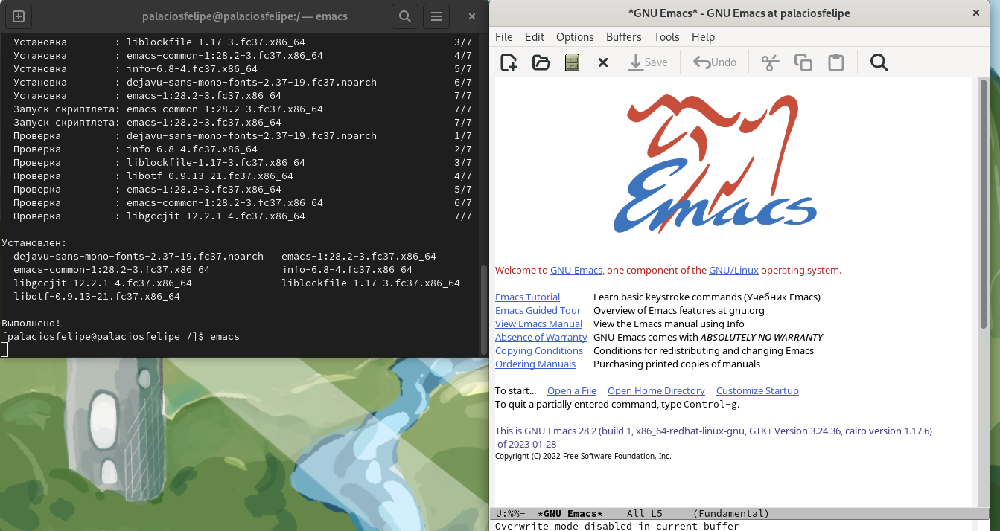{#fig:001 width=70%}

2. Создать файл lab07.sh с помощью комбинации Ctrl-x Ctrl-f (C-x C-f) (рис. @fig:002)

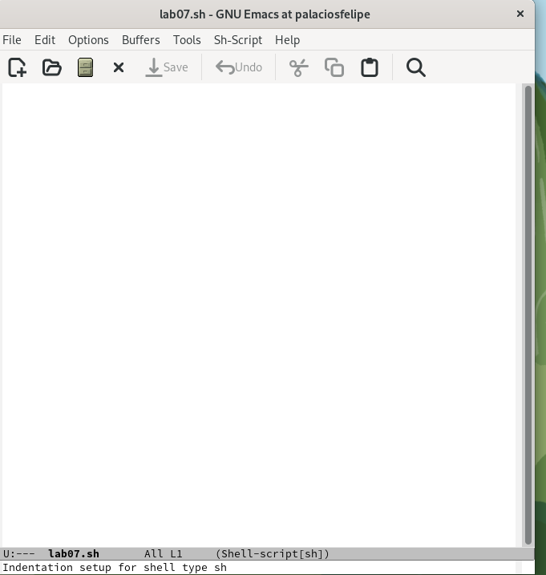{#fig:002 width=70%}

3. Наберите текст (рис. @fig:003)

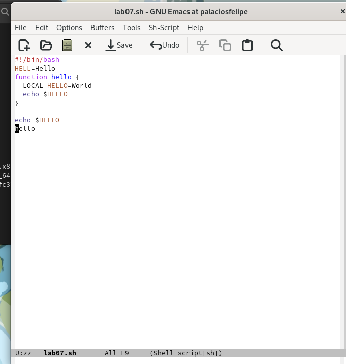{#fig:003 width=70%}

4. Сохранить файл с помощью комбинации Ctrl-x Ctrl-s (C-x C-s) (рис. @fig:004)

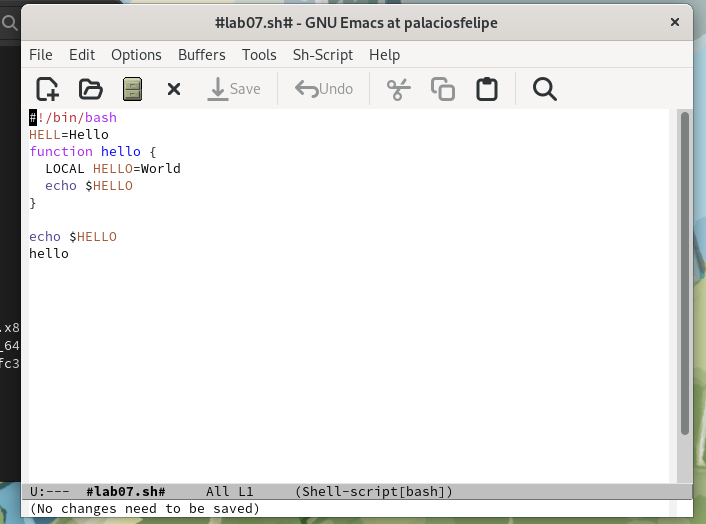{#fig:004 width=70%}

5. Проделать с текстом стандартные процедуры редактирования, каждое действие должно осуществляться комбинацией клавиш 
5.1. Вырезать одной командой целую строку (С-k) (рис. @fig:005)

{#fig:005 width=70%}

5.2. Вставить эту строку в конец файла (C-y) (рис. @fig:006)

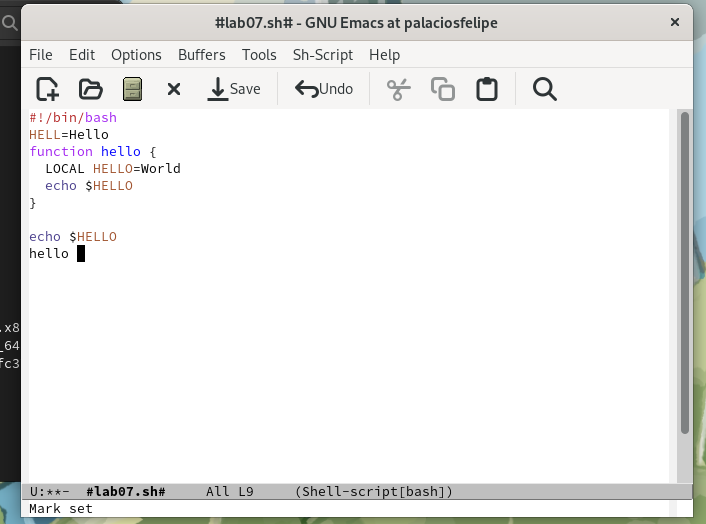{#fig:006 width=70%}

5.3. Выделить область текста (C-space) (рис. @fig:007)

{#fig:007 width=70%}

5.4. Скопировать область в буфер обмена (M-w) 

5.5. Вставить область в конец файла (рис. @fig:008)

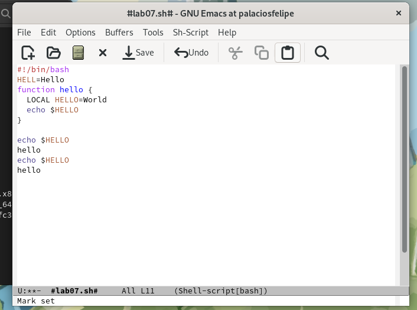{#fig:008 width=70%}

5.6. Вновь выделить эту область и на этот раз вырезать её (C-w) (рис. @fig:009)

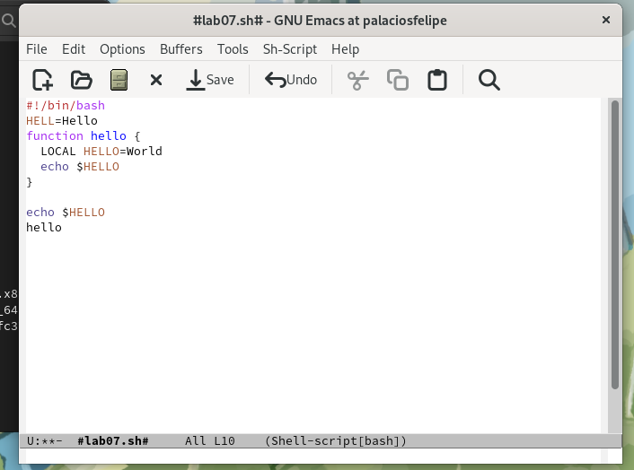{#fig:009 width=70%}

5.7. Отмените последнее действие (C-/) (рис. @fig:010)

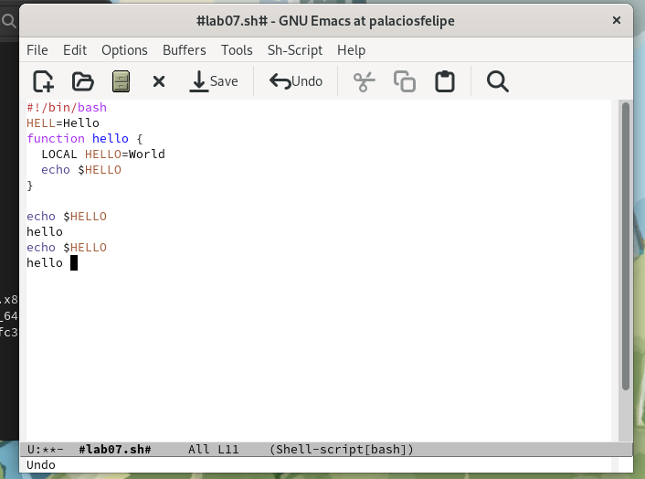{#fig:010 width=70%}

6. Научитесь использовать команды по перемещению курсора 

6.1. Переместите курсор в начало строки (C-a) (рис. @fig:011)

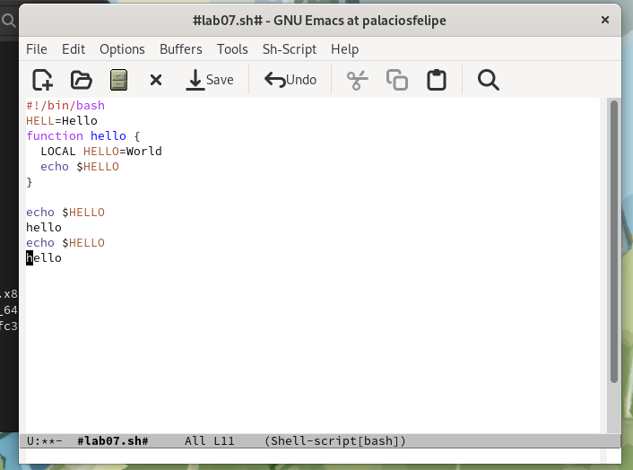{#fig:011 width=70%}

6.2. Переместите курсор в конец строки (C-e) (рис. @fig:012)

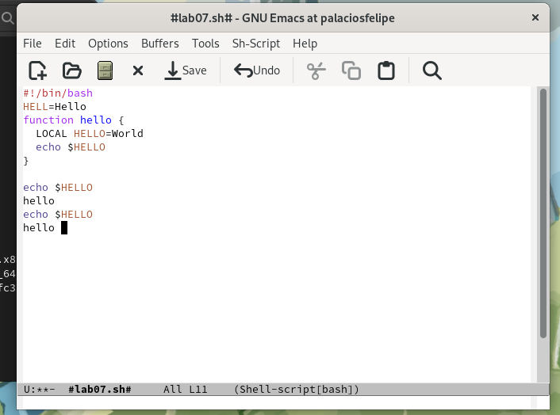{#fig:012 width=70%}

6.3. Переместите курсор в начало буфера (M-<) 
6.4. Переместите курсор в конец буфера (M->) 

7. Управление буферами 

7.1. Вывести список активных буферов на экран (C-x C-b) (рис. @fig:013)

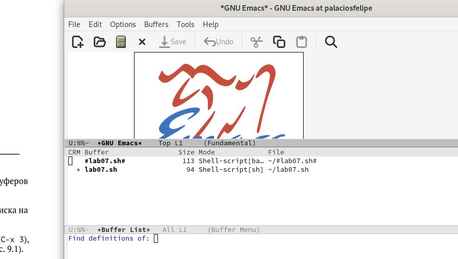{#fig:013 width=70%}

7.2. Переместитесь во вновь открытое окно (C-x) o со списком открытых буферов и переключитесь на другой буфер (рис. @fig:014)

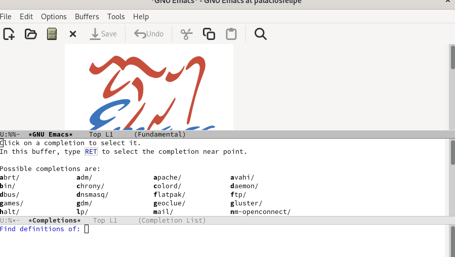{#fig:014 width=70%}

7.3. Закройте это окно (C-x 0) (рис. @fig:015)

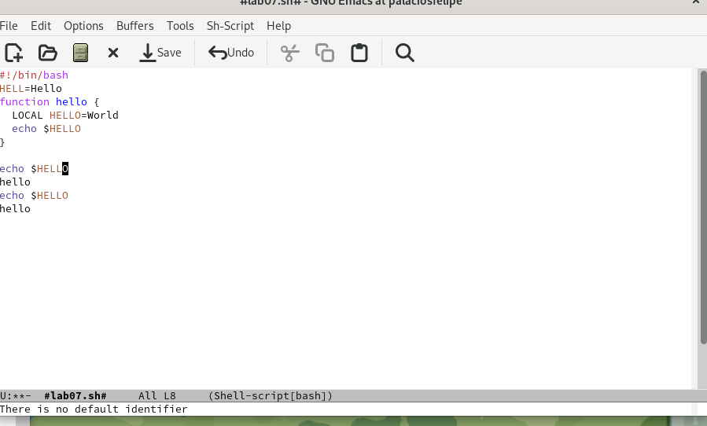{#fig:015 width=70%}

7.4. Теперь вновь переключайтесь между буферами, но уже без вывода их списка на экран (C-x b) (рис. @fig:016)

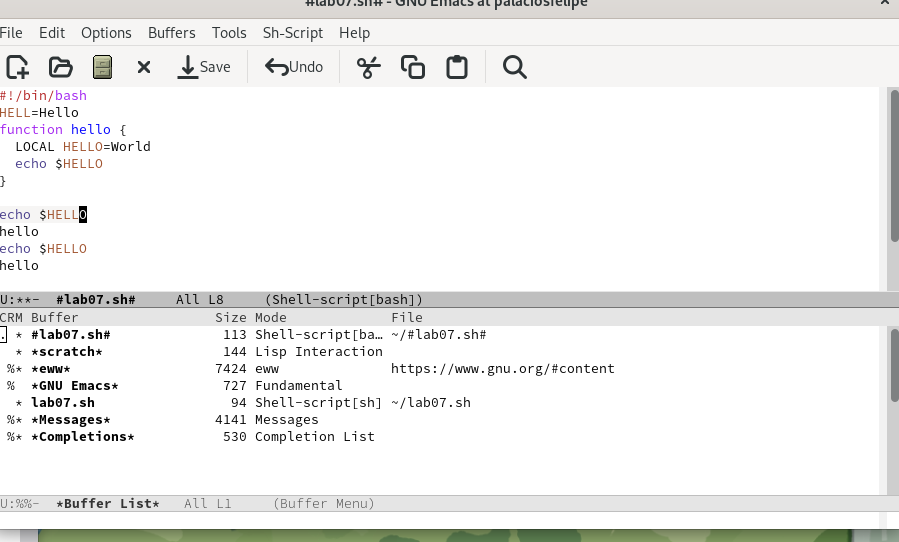{#fig:016 width=70%}

8. Управление окнами 

8.1. Поделите фрейм на 4 части: разделите фрейм на два окна по вертикали (C-x 3), а затем каждое из этих окон на две части по горизонтали (C-x 2) (рис. @fig:017)

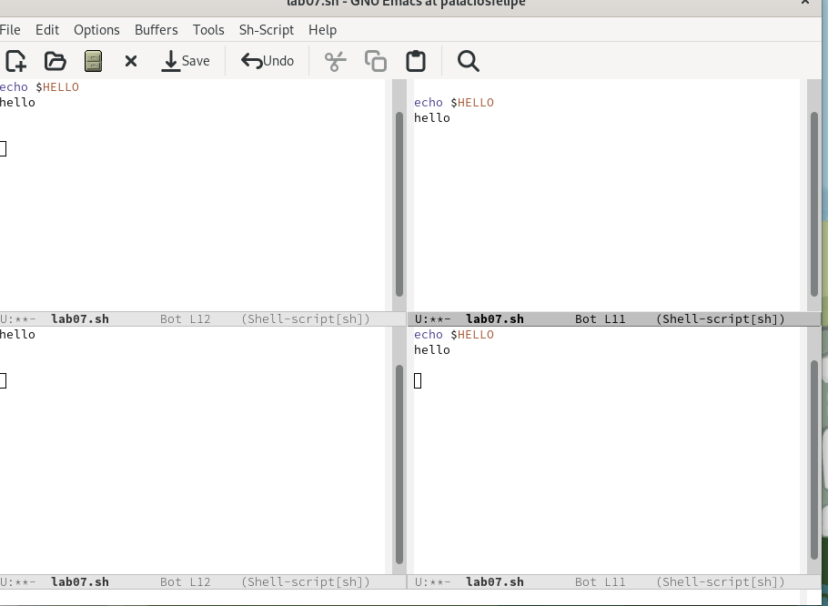{#fig:017 width=70%}

8.2. В каждом из четырёх созданных окон откройте новый буфер (файл) и введите несколько строк текста (рис. @fig:018)

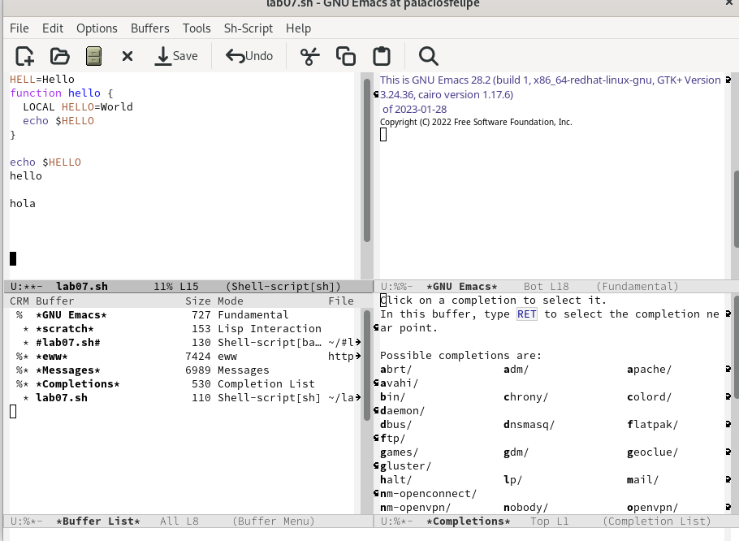{#fig:018 width=70%}

9. Режим поиска

9.1. Переключитесь в режим поиска (C-s) и найдите несколько слов, присутствующих в тексте (рис. @fig:019)

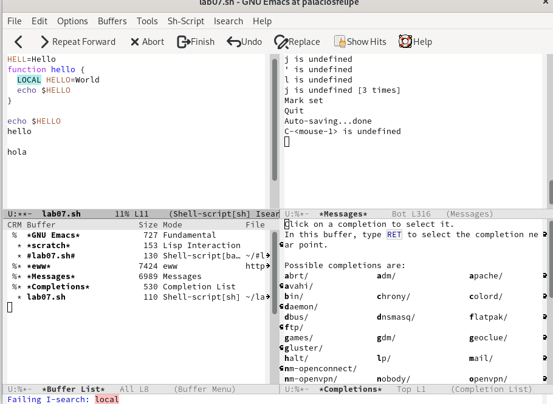{#fig:019 width=70%}

9.2. Переключайтесь между результатами поиска, нажимая C-s (рис. @fig:020)

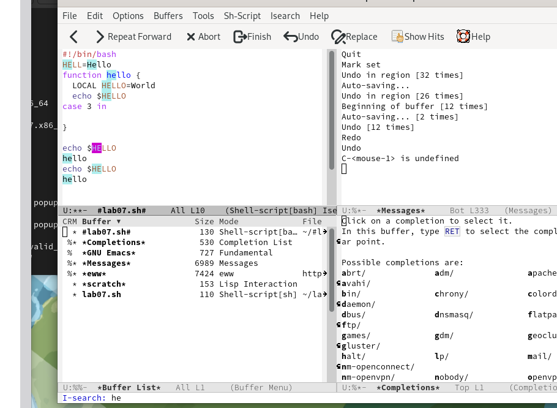{#fig:020 width=70%}

9.3. Выйдите из режима поиска, нажав C-g (рис. @fig:021)

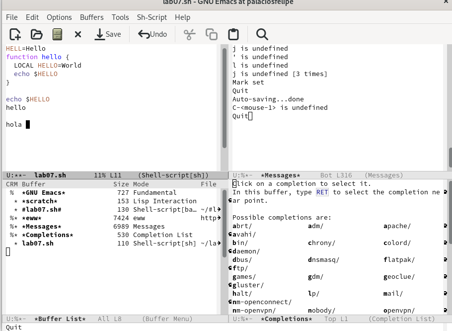{#fig:021 width=70%}

9.4. Перейдите в режим поиска и замены (M-%), введите текст, который следует найти и заменить, нажмите Enter , затем введите текст для замены. После того как будут подсвечены результаты поиска, нажмите ! для подтверждения замены 

9.5. Испробуйте другой режим поиска, нажав M-s o. Объясните, чем он отличается от обычного режима? (рис. @fig:022)
Не выделяет слово в тексте, а вытаскивает в окно

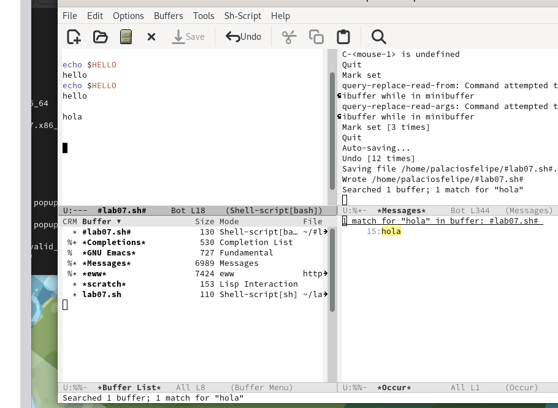{#fig:022 width=70%}

# Выводы

Познакомился с операционной системой Linux. Получил практические навыки рабо-
ты с редактором Emacs.

