---
## Front matter
lang: ru-RU
title: Лабораторная работа 13
subtitle: Средства, применяемые приразработке программного обеспечения в ОС типа UNIX/Linux
author:
  - Паласиос Ф. 
institute:
  - Российский университет дружбы народов, Москва, Россия
  
date: 05 мая 2023

## i18n babel
babel-lang: russian
babel-otherlangs: english

## Formatting pdf
toc: false
toc-title: Содержание
slide_level: 2
aspectratio: 169
section-titles: true
theme: metropolis
header-includes:
 - \metroset{progressbar=frametitle,sectionpage=progressbar,numbering=fraction}
 - '\makeatletter'
 - '\beamer@ignorenonframefalse'
 - '\makeatother'
---

# Информация

## Докладчик

:::::::::::::: {.columns align=center}
::: {.column width="70%"}

  * Паласиос Фелипе
  * студент группы НКАбд - 04 - 22
  * Российский университет дружбы народов

:::
::: {.column width="30%"}

:::
::::::::::::::

# Вводная часть

## Цели 

Приобрести простейшие навыки разработки, анализа, тестирования и отладки при-
ложений в ОС типа UNIX/Linux на примере создания на языке программирования
С калькулятора с простейшими функциями.

## Задачи
1. В домашнем каталоге создайте подкаталог ~/work/os/lab_prog.

2. Создайте в нём файлы: calculate.h, calculate.c, main.c.
Это будет примитивнейший калькулятор, способный складывать, вычитать, умножать
и делить, возводить число в степень, брать квадратный корень, вычислять sin, cos, tan.
При запуске он будет запрашивать первое число, операцию, второе число. После этого
программа выведет результат и остановится.
Реализация функций калькулятора в файле calculate.h:

Интерфейсный файл calculate.h, описывающий формат вызова функции-
калькулятора:

Основной файл main.c, реализующий интерфейс пользователя к калькулятору:

## Задачи

3. Выполните компиляцию программы посредством gcc:

4. При необходимости исправьте синтаксические ошибки.

5. Создайте Makefile со следующим содержанием:

## Задачи

6. С помощью gdb выполните отладку программы calcul (перед использованием gdb
исправьте Makefile):
– Запустите отладчик GDB, загрузив в него программу для отладки
– Для запуска программы внутри отладчика введите команду run:
– Для постраничного (по 9 строк) просмотра исходного код используйте команду
list:
– Для просмотра строк с 12 по 15 основного файла используйте list с параметрами:

– Для просмотра определённых строк не основного файла используйте list с па-
раметрами
 
## Задачи
 
 – Установите точку останова в файле calculate.c на строке номер 21:
 
 – Выведите информацию об имеющихся в проекте точка останова:
 
 – Запустите программу внутри отладчика и убедитесь, что программа остановится
в момент прохождения точки останова:

– Отладчик выдаст следующую информацию:
а команда backtrace покажет весь стек вызываемых функций от начала програм-
мы до текущего места.

## Задачи

– Посмотрите, чему равно на этом этапе значение переменной Numeral, введя:
На экран должно быть выведено число 5.

– Сравните с результатом вывода на экран после использования команды:

– Уберите точки останова. 
 
 7. С помощью утилиты splint попробуйте проанализировать коды файлов calculate.c и main.c

# Выполнение лабораторной работы
## Результаты

1. В домашнем каталоге создайте подкаталог ~/work/os/lab_prog.

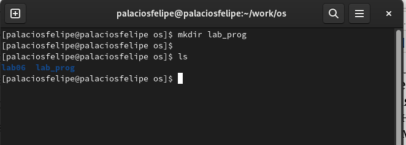

## Результаты

2. Создайте в нём файлы: calculate.h, calculate.c, main.c.

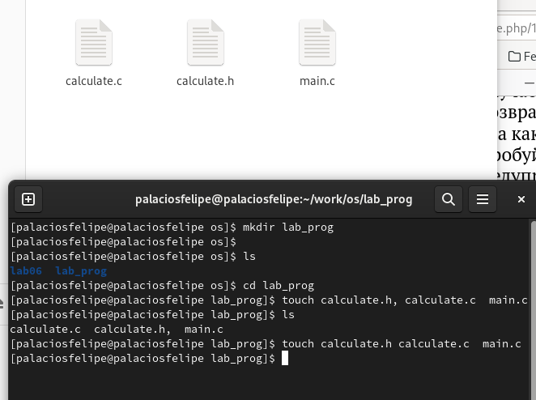

## Результаты

Реализация функций калькулятора в файле calculate.c

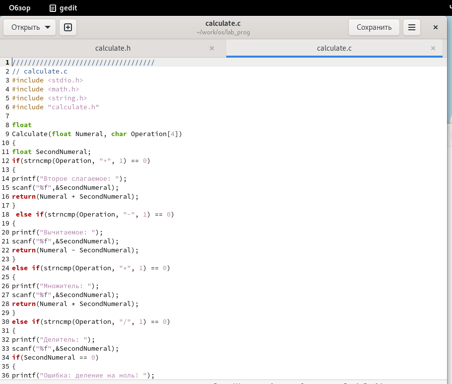

## Результаты

Интерфейсный файл calculate.h, описывающий формат вызова функции-
калькулятора:

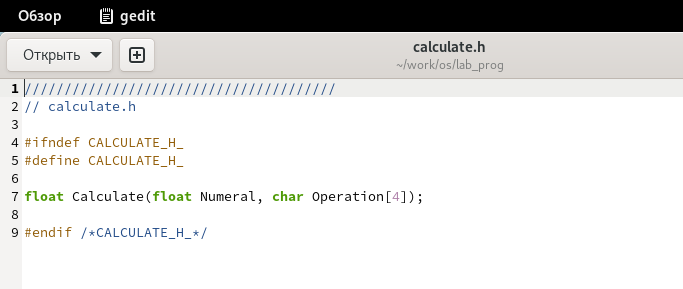

## Результаты

Основной файл main.c, реализующий интерфейс пользователя к калькулятору

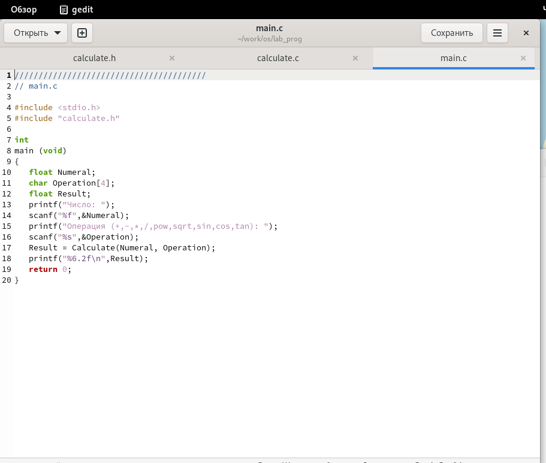

## Результаты

3. Выполните компиляцию программы посредством gcc:

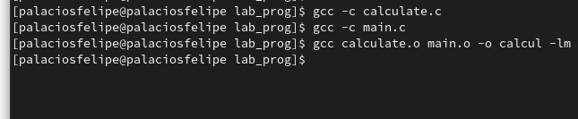

## Результаты

4. При необходимости исправьте синтаксические ошибки.

5. Создайте Makefile со следующим содержанием:

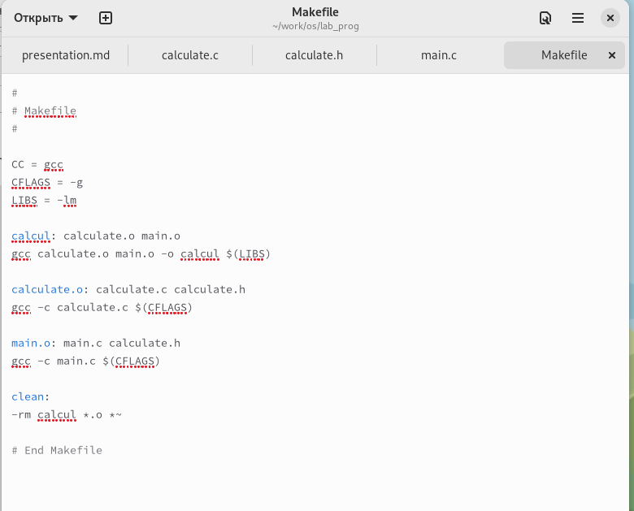

## Результаты

6. С помощью gdb выполните отладку программы calcul (перед использованием gdbисправьте Makefile)

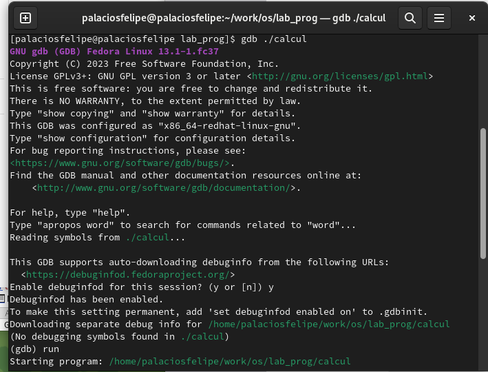

## Результаты

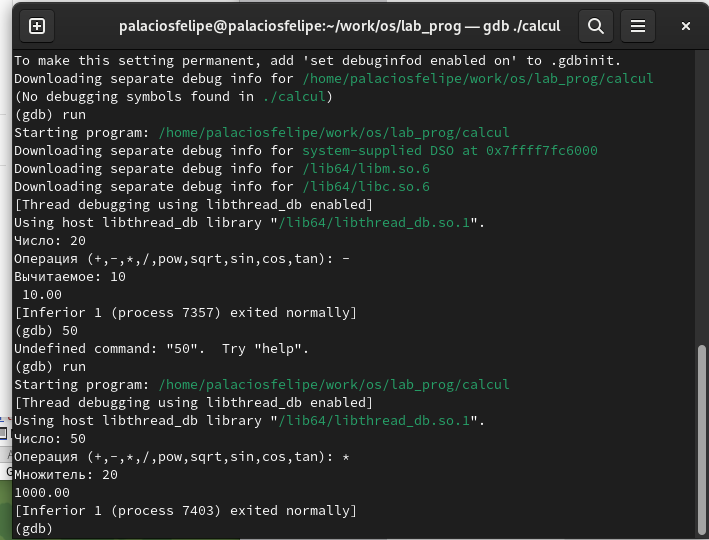

## Результаты

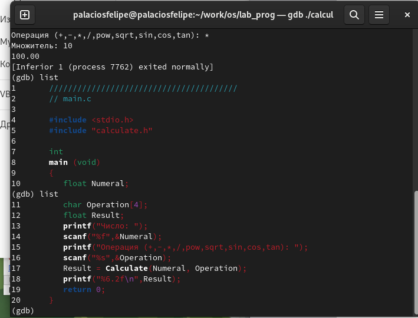

## Результаты

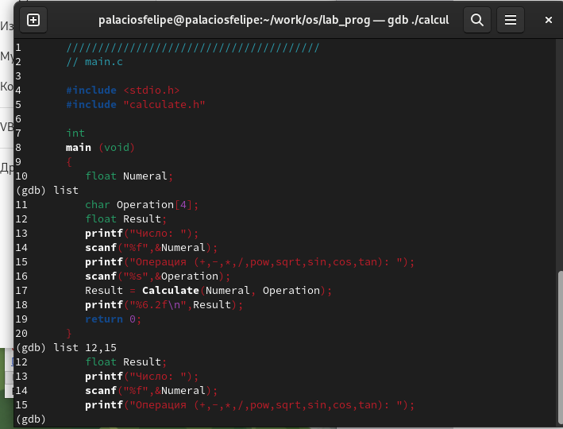

## Результаты

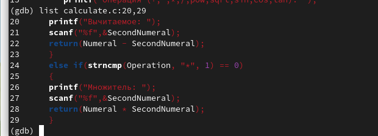

## Результаты

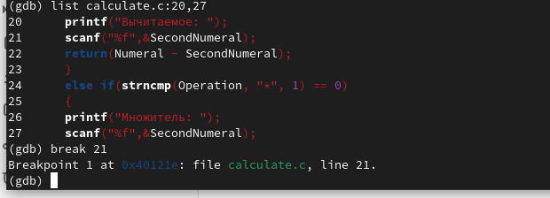

## Результаты

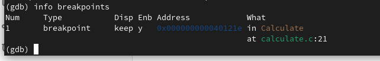

## Результаты

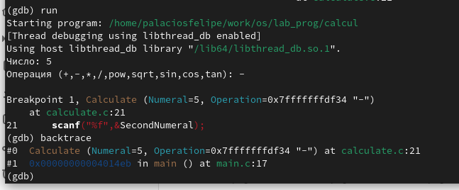

## Результаты

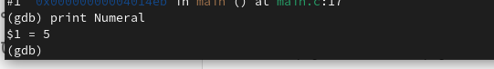

## Результаты

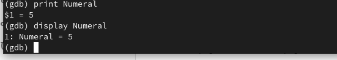

## Результаты

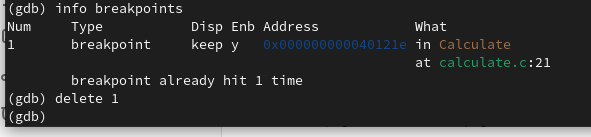

## Результаты

 7. С помощью утилиты splint попробуйте проанализировать коды файлов calculate.c и main.c
 
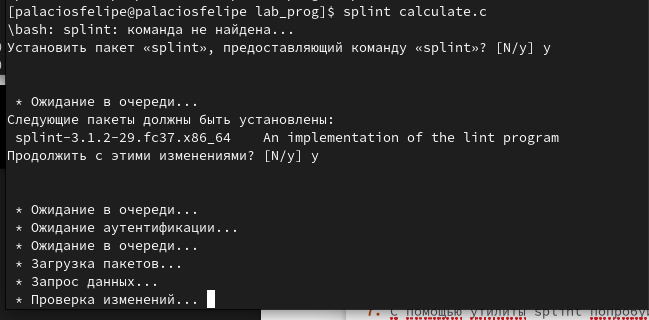

## Результаты

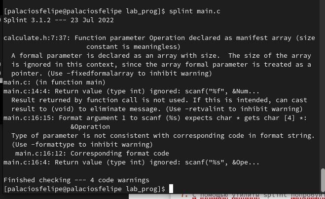

## Результаты

Приобрел простейшие навыки разработки, анализа, тестирования и отладки приложений в ОС типа UNIX/Linux на примере создания на языке программирования С калькулятора с простейшими функциями.

