---
## Front matter
title: "Лабораторная работа No 13."
subtitle: "Средства, применяемые приразработке программного обеспечения в ОС типа UNIX/Linux"
author: "Паласиос Фелипe"

## Generic otions
lang: ru-RU
toc-title: "Содержание"

## Bibliography
bibliography: bib/cite.bib
csl: pandoc/csl/gost-r-7-0-5-2008-numeric.csl

## Pdf output format
toc: true # Table of contents
toc-depth: 2
lof: true # List of figures
lot: true # List of tables
fontsize: 12pt
linestretch: 1.5
papersize: a4
documentclass: scrreprt
## I18n polyglossia
polyglossia-lang:
  name: russian
  options:
	- spelling=modern
	- babelshorthands=true
polyglossia-otherlangs:
  name: english
## I18n babel
babel-lang: russian
babel-otherlangs: english
## Fonts
mainfont: PT Serif
romanfont: PT Serif
sansfont: PT Sans
monofont: PT Mono
mainfontoptions: Ligatures=TeX
romanfontoptions: Ligatures=TeX
sansfontoptions: Ligatures=TeX,Scale=MatchLowercase
monofontoptions: Scale=MatchLowercase,Scale=0.9
## Biblatex
biblatex: true
biblio-style: "gost-numeric"
biblatexoptions:
  - parentracker=true
  - backend=biber
  - hyperref=auto
  - language=auto
  - autolang=other*
  - citestyle=gost-numeric
## Pandoc-crossref LaTeX customization
figureTitle: "Рис."
tableTitle: "Таблица"
listingTitle: "Листинг"
lofTitle: "Список иллюстраций"
lotTitle: "Список таблиц"
lolTitle: "Листинги"
## Misc options
indent: true
header-includes:
  - \usepackage{indentfirst}
  - \usepackage{float} # keep figures where there are in the text
  - \floatplacement{figure}{H} # keep figures where there are in the text
---

# Цель работы

Приобрести простейшие навыки разработки, анализа, тестирования и отладки при-
ложений в ОС типа UNIX/Linux на примере создания на языке программирования
С калькулятора с простейшими функциями.

# Задание

1. В домашнем каталоге создайте подкаталог ~/work/os/lab_prog.

2. Создайте в нём файлы: calculate.h, calculate.c, main.c.
Это будет примитивнейший калькулятор, способный складывать, вычитать, умножать
и делить, возводить число в степень, брать квадратный корень, вычислять sin, cos, tan.
При запуске он будет запрашивать первое число, операцию, второе число. После этого
программа выведет результат и остановится.
Реализация функций калькулятора в файле calculate.h:

Интерфейсный файл calculate.h, описывающий формат вызова функции-
калькулятора:

Основной файл main.c, реализующий интерфейс пользователя к калькулятору:

3. Выполните компиляцию программы посредством gcc:

4. При необходимости исправьте синтаксические ошибки.

5. Создайте Makefile со следующим содержанием:

6. С помощью gdb выполните отладку программы calcul (перед использованием gdb
исправьте Makefile):
– Запустите отладчик GDB, загрузив в него программу для отладки
– Для запуска программы внутри отладчика введите команду run:
– Для постраничного (по 9 строк) просмотра исходного код используйте команду
list:
– Для просмотра строк с 12 по 15 основного файла используйте list с параметрами:

– Для просмотра определённых строк не основного файла используйте list с па-
раметрами:
 
 – Установите точку останова в файле calculate.c на строке номер 21:
 
 – Выведите информацию об имеющихся в проекте точка останова:
 
 – Запустите программу внутри отладчика и убедитесь, что программа остановится
в момент прохождения точки останова:

– Отладчик выдаст следующую информацию:
а команда backtrace покажет весь стек вызываемых функций от начала програм-
мы до текущего места.

– Посмотрите, чему равно на этом этапе значение переменной Numeral, введя:
На экран должно быть выведено число 5.

– Сравните с результатом вывода на экран после использования команды:

– Уберите точки останова

 7. С помощью утилиты splint попробуйте проанализировать коды файлов calculate.c
и main.c

# Выполнение лабораторной работы

1. В домашнем каталоге создайте подкаталог ~/work/os/lab_prog.
(рис. @fig:001)

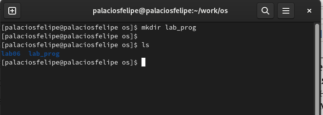{#fig:001 width=70%}

2. Создайте в нём файлы: calculate.h, calculate.c, main.c.
(рис. @fig:002)

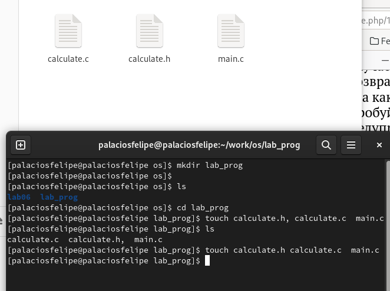{#fig:002 width=70%}

Реализация функций калькулятора в файле calculate.c(рис. @fig:003)

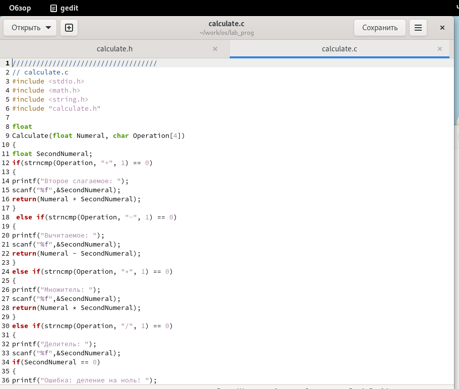{#fig:003 width=70%}

Интерфейсный файл calculate.h, описывающий формат вызова функции-
калькулятора:рис. @fig:004)

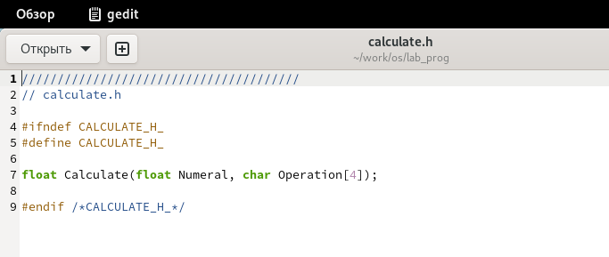{#fig:004 width=70%}

Основной файл main.c, реализующий интерфейс пользователя к калькулятору:рис. @fig:005)

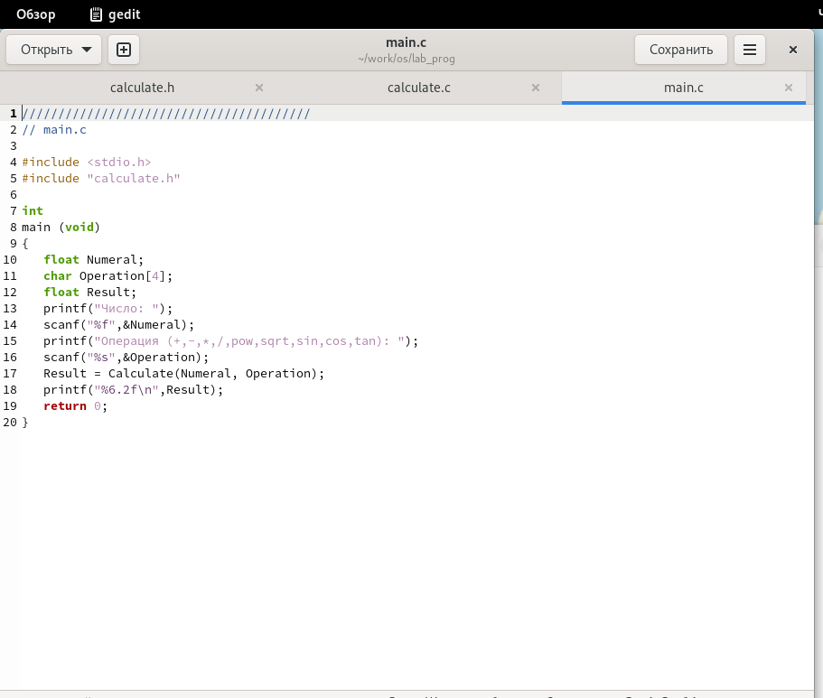{#fig:005 width=70%}

3. Выполните компиляцию программы посредством gcc:
(рис. @fig:006)

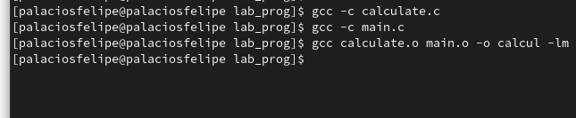{#fig:006 width=70%}

4. При необходимости исправьте синтаксические ошибки.

5. Создайте Makefile со следующим содержанием:
(рис. @fig:007)

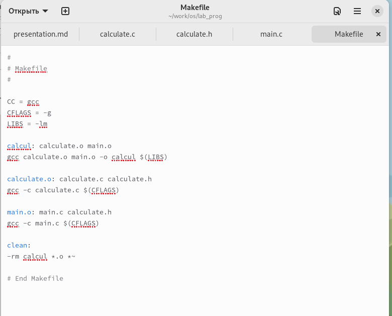{#fig:007 width=70%}

6. С помощью gdb выполните отладку программы calcul (перед использованием gdbисправьте Makefile)(рис. @fig:008, @fig:009, @fig:010, @fig:011, @fig:012, @fig:013, @fig:014, @fig:015, @fig:016, @fig:017, @fig:018)

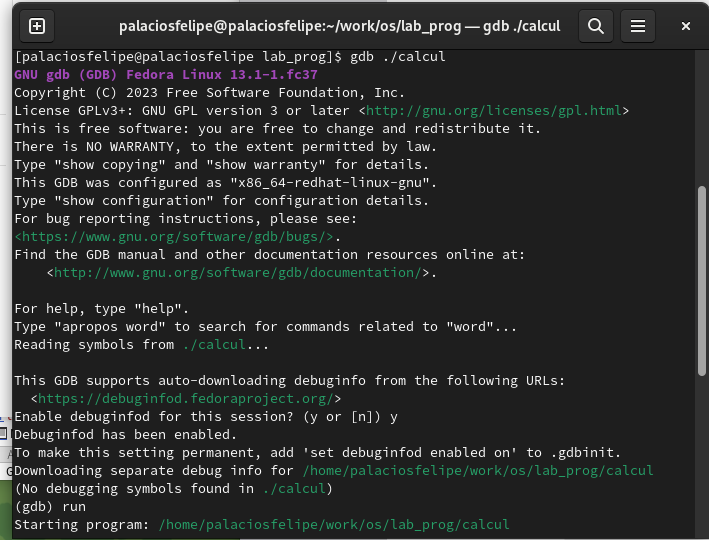{#fig:008 width=70%}

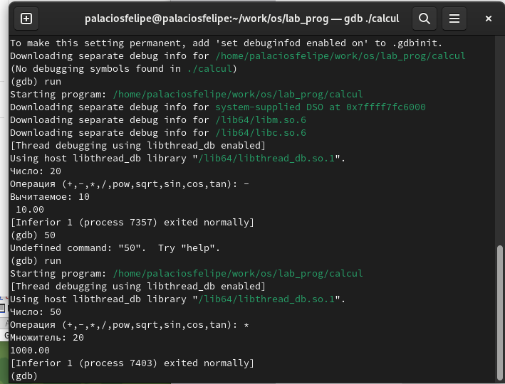{#fig:009 width=70%}

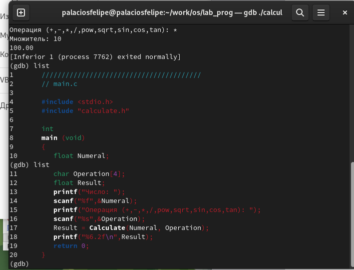{#fig:010 width=70%}

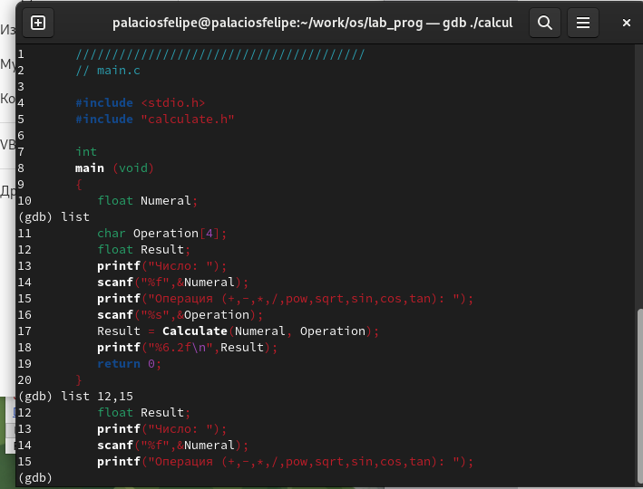{#fig:011 width=70%}

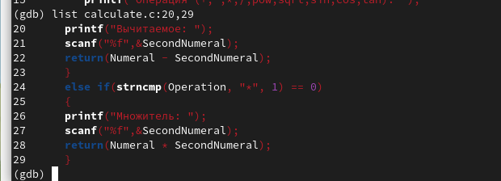{#fig:012 width=70%}

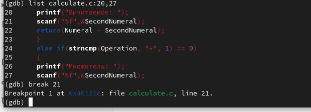{#fig:013 width=70%}

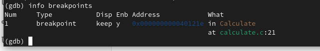{#fig:014 width=70%}

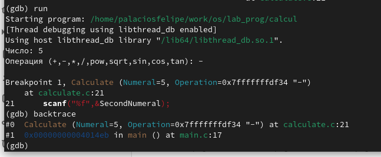{#fig:015 width=70%}

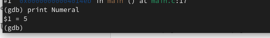{#fig:016 width=70%}

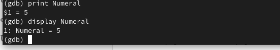{#fig:017 width=70%}

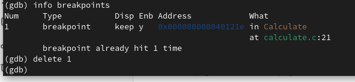{#fig:018 width=70%}

 7. С помощью утилиты splint попробуйте проанализировать коды файлов calculate.c и main.c (рис. @fig:019, @fig:020)
 
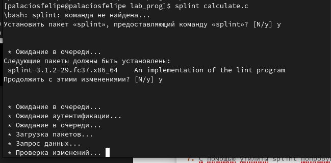{#fig:019 width=70%}

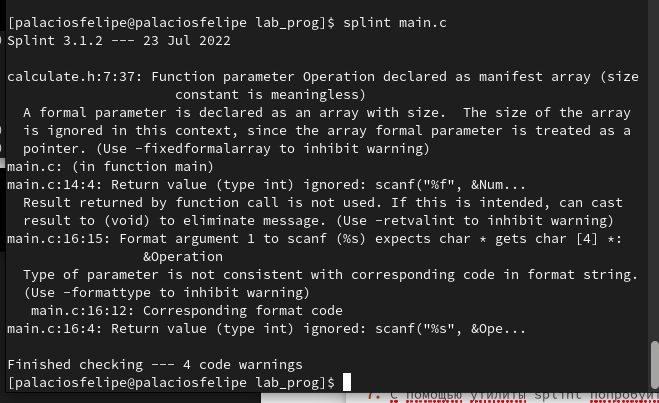{#fig:020 width=70%}

# Выводы

Приобрел простейшие навыки разработки, анализа, тестирования и отладки приложений в ОС типа UNIX/Linux на примере создания на языке программирования С калькулятора с простейшими функциями.
