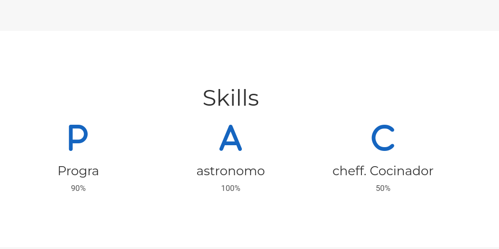
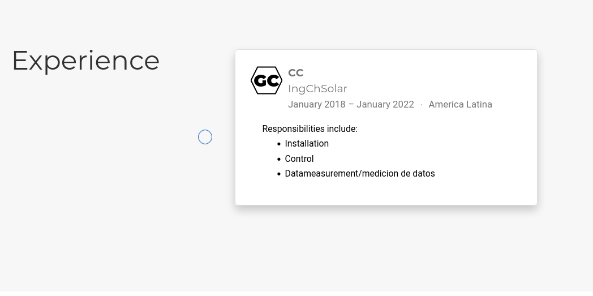
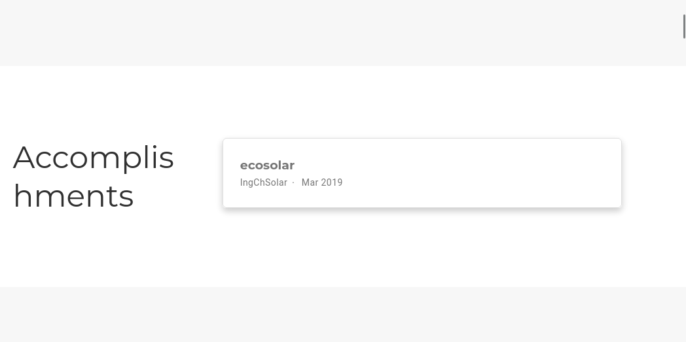
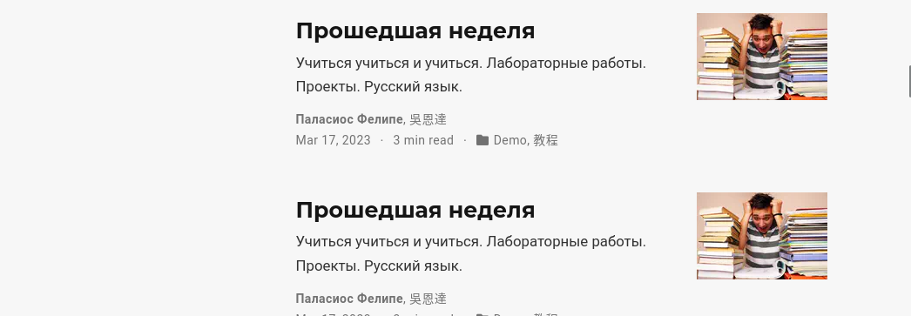

---
## Front matter
lang: ru-RU
title: Проект
subtitle: Третий этап
author:
  - Паласиос Ф. 
institute:
  - Российский университет дружбы народов, Москва, Россия
date:  08 апреля 2023

## i18n babel
babel-lang: russian
babel-otherlangs: english

## Formatting pdf
toc: false
toc-title: Содержание
slide_level: 2
aspectratio: 169
section-titles: true
theme: metropolis
header-includes:
 - \metroset{progressbar=frametitle,sectionpage=progressbar,numbering=fraction}
 - '\makeatletter'
 - '\beamer@ignorenonframefalse'
 - '\makeatother'
---

# Информация

## Докладчик

:::::::::::::: {.columns align=center}
::: {.column width="70%"}

  * Паласиос Фелипе
  * студент группы НКАбд - 04 - 22
  * Российский университет дружбы народов

:::
::: {.column width="30%"}

:::
::::::::::::::

# Вводная часть

## Цель

Научиться создавать персональный сайт научного работника

## Задачи

1. Добавить информацию о навыках (Skills).
2. Добавить информацию об опыте (Experience).

## Задачи

3. Добавить информацию о достижениях (Accomplishments).
4. Сделать пост по прошедшей неделе.
5. Добавить пост на тему Язык разметки Markdown.

# Выполнение лабораторной работы

## Результаты

1. Добавить информацию о навыках (Skills)

## Результаты

2. Добавить информацию об опыте (Experience)

## Результаты

3. Добавить информацию о достижениях (Accomplishments)

## Результаты

4. Сделать пост по прошедшей неделе

## Результаты

5. Добавить пост на тему Язык разметки Markdown

## Результаты

Сайт создан. Информация о достижениях добавлена

