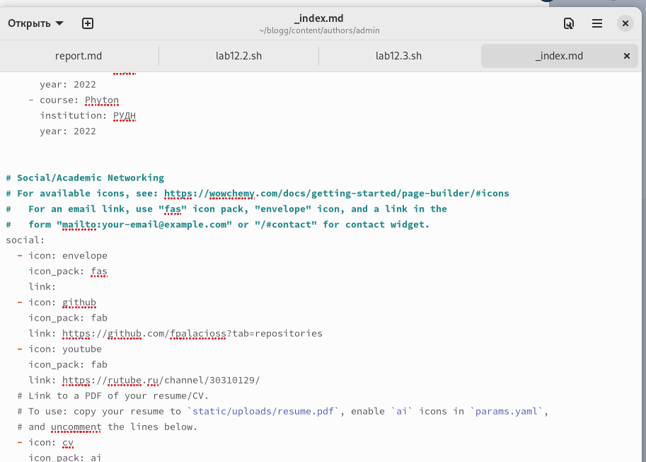
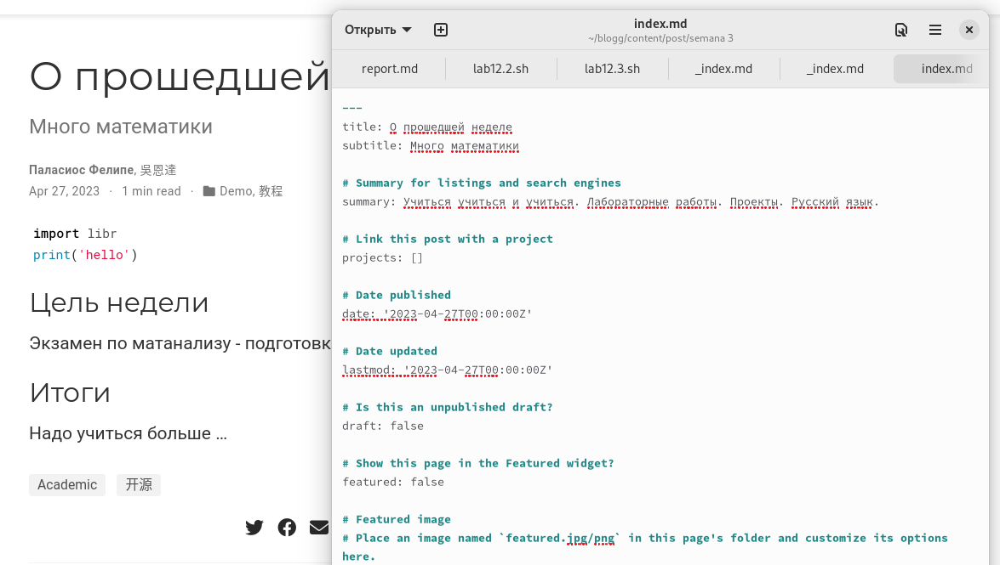
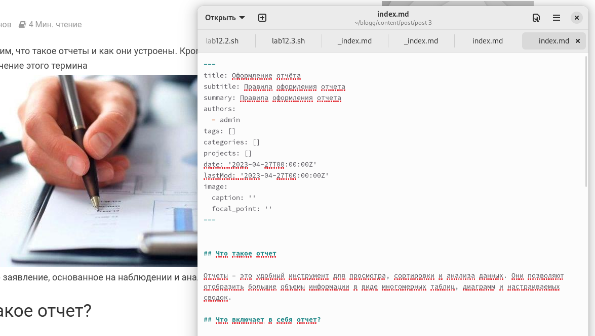

---
## Front matter
lang: ru-RU
title: Проект
subtitle: Четвертый этап
author:
  - Паласиос Ф. 
institute:
  - Российский университет дружбы народов, Москва, Россия
date:  27 апреля 2023

## i18n babel
babel-lang: russian
babel-otherlangs: english

## Formatting pdf
toc: false
toc-title: Содержание
slide_level: 2
aspectratio: 169
section-titles: true
theme: metropolis
header-includes:
 - \metroset{progressbar=frametitle,sectionpage=progressbar,numbering=fraction}
 - '\makeatletter'
 - '\beamer@ignorenonframefalse'
 - '\makeatother'
---

# Информация

## Докладчик

:::::::::::::: {.columns align=center}
::: {.column width="70%"}

  * Паласиос Фелипе
  * студент группы НКАбд - 04 - 22
  * Российский университет дружбы народов

:::
::: {.column width="30%"}

:::
::::::::::::::

# Вводная часть

## Цель

Добавить информацию на сайт

## Задачи

1. Добавить к сайту ссылки на научные и библиометрические ресурсы.
2. Сделать пост по прошедшей неделе.
3. Добавить пост на тему Оформление отчёта.

# Выполнение лабораторной работы

## Результаты

1. Добавить к сайту ссылки на научные и библиометрические ресурсы 

## Результаты

2. Сделать пост по прошедшей неделе 

## Результаты

3. Добавить пост на тему Оформление отчёта 

## Результаты

Информация добавлена
